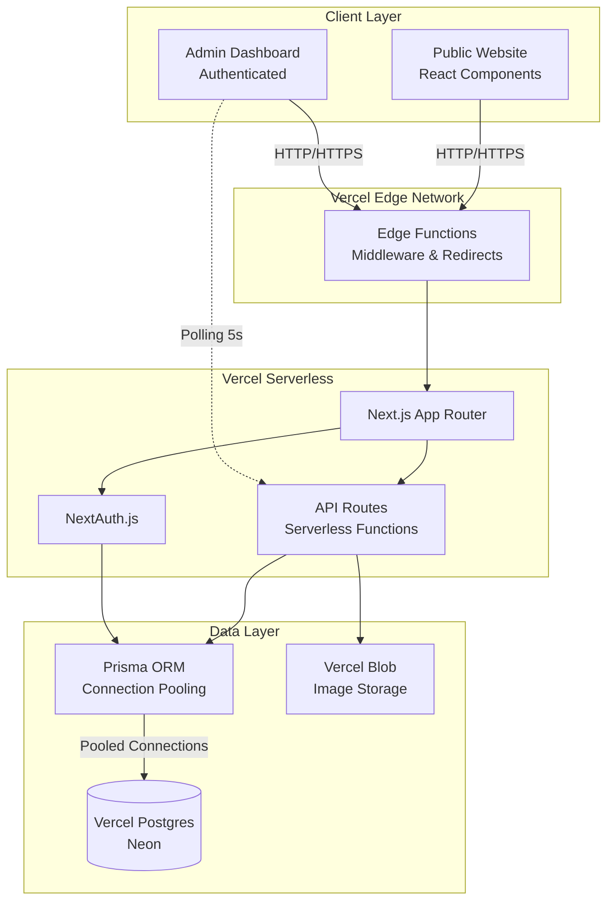
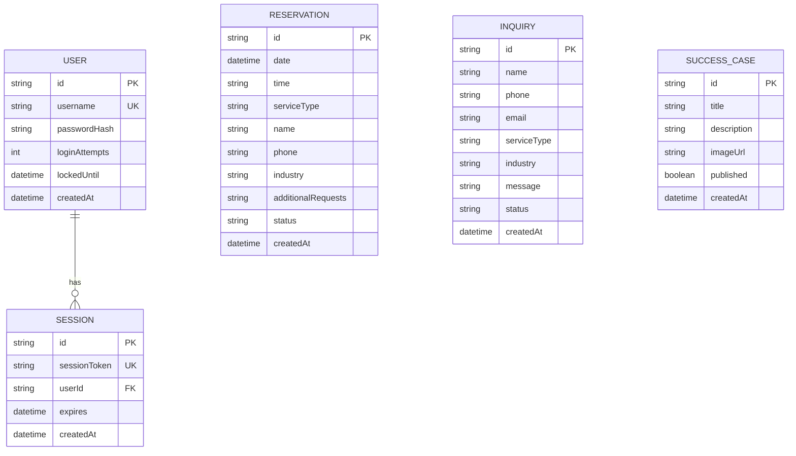

# Technical Design Document

## Overview

The WEFLOW Website Platform is a full-stack web application built on Next.js 14+ (App Router) and deployed on Vercel with Vercel Postgres as the serverless database backend. The platform consists of two primary components:

1. **Public-Facing Website**: A multi-page marketing and service website featuring home, services, pricing, success cases, booking calendar, free diagnosis form, and marketing landing pages
2. **Admin Dashboard**: An authenticated administrative interface for managing reservations, inquiries, and success case content

### Technology Stack Summary

- **Frontend Framework**: Next.js 14+ (App Router) with React 18+
- **Styling**: Tailwind CSS (mobile-first responsive design)
- **Database**: Vercel Postgres (Neon-based serverless PostgreSQL)
- **ORM**: Prisma with connection pooling optimized for serverless
- **Authentication**: NextAuth.js (session-based)
- **File Storage**: Vercel Blob (image uploads)
- **File Export**: SheetJS (xlsx library) for Excel generation
- **Calendar**: react-datepicker or custom calendar with date-fns
- **Real-time Updates**: Polling-based approach with 5-second intervals
- **Deployment**: Vercel with serverless functions
- **Database Connection**: @vercel/postgres with connection pooling

### Deployment Architecture

The application leverages Vercel's serverless architecture:
- **Frontend**: Static pages and React Server Components rendered on-demand
- **API Routes**: Next.js API routes deployed as Vercel serverless functions
- **Database**: Vercel Postgres with connection pooling to handle serverless ephemeral connections
- **File Storage**: Vercel Blob for success case images
- **Edge Functions**: Potential use for authentication middleware and redirects

### Key Design Principles

1. **Serverless-First**: All backend logic runs in stateless serverless functions
2. **Connection Pooling**: Prisma configured with connection pooling to prevent database connection exhaustion
3. **Mobile-First**: Responsive design prioritizing mobile experience with sticky bottom navigation
4. **SEO Optimization**: Server-side rendering for public pages with proper meta tags
5. **Compliance**: Content validation to prevent prohibited medical/healthcare content
6. **Real-time Updates**: Polling-based dashboard updates (5-second intervals) for reservation/inquiry changes
7. **Performance**: Static generation where possible, dynamic rendering for data-driven pages


## Architecture

### System Architecture



### Application Structure

```
weflow-platform/
├── app/
│   ├── (public)/                  # Public-facing pages (grouped route)
│   │   ├── page.tsx              # Home page
│   │   ├── services/
│   │   │   └── page.tsx          # Services page
│   │   ├── pricing/
│   │   │   └── page.tsx          # Pricing page
│   │   ├── success-cases/
│   │   │   ├── page.tsx          # Gallery page
│   │   │   └── [id]/
│   │   │       └── page.tsx      # Detail view
│   │   ├── booking/
│   │   │   └── page.tsx          # Calendar booking
│   │   ├── free-diagnosis/
│   │   │   └── page.tsx          # Free diagnosis form
│   │   ├── contact/
│   │   │   └── page.tsx          # General inquiry
│   │   └── landing/
│   │       └── page.tsx          # Marketing landing page
│   ├── (admin)/                   # Admin dashboard (grouped route)
│   │   ├── layout.tsx            # Admin layout with auth check
│   │   ├── login/
│   │   │   └── page.tsx          # Login page
│   │   ├── dashboard/
│   │   │   └── page.tsx          # Dashboard home
│   │   ├── reservations/
│   │   │   └── page.tsx          # Reservation management
│   │   ├── inquiries/
│   │   │   └── page.tsx          # Inquiry management
│   │   └── success-cases/
│   │       ├── page.tsx          # Success case list
│   │       ├── new/
│   │       │   └── page.tsx      # Create success case
│   │       └── [id]/
│   │           └── edit/
│   │               └── page.tsx  # Edit success case
│   ├── api/
│   │   ├── auth/
│   │   │   └── [...nextauth]/
│   │   │       └── route.ts      # NextAuth configuration
│   │   ├── reservations/
│   │   │   ├── route.ts          # GET, POST reservations
│   │   │   ├── [id]/
│   │   │   │   └── route.ts      # PATCH, DELETE reservation
│   │   │   └── export/
│   │   │       └── route.ts      # Excel export
│   │   ├── inquiries/
│   │   │   ├── route.ts          # GET, POST inquiries
│   │   │   ├── [id]/
│   │   │   │   └── route.ts      # PATCH inquiry
│   │   │   └── export/
│   │   │       └── route.ts      # Excel export
│   │   ├── success-cases/
│   │   │   ├── route.ts          # GET, POST success cases
│   │   │   └── [id]/
│   │   │       └── route.ts      # PATCH, DELETE success case
│   │   └── upload/
│   │       └── route.ts          # Image upload to Vercel Blob
│   ├── layout.tsx                # Root layout
│   └── globals.css               # Global styles with Tailwind
├── components/
│   ├── public/
│   │   ├── Navigation.tsx        # Main navigation (logo + categories)
│   │   ├── StickyBottomNav.tsx   # Always-visible bottom action bar (all viewports)
│   │   ├── Footer.tsx            # Site footer (company info, link columns)
│   │   ├── Hero.tsx              # Hero banner
│   │   ├── TestimonialCarousel.tsx
│   │   ├── CalendarInterface.tsx # Booking calendar
│   │   ├── SuccessCaseCard.tsx
│   │   └── ContactForm.tsx
│   └── admin/
│       ├── ReservationTable.tsx
│       ├── InquiryTable.tsx
│       ├── SuccessCaseForm.tsx
│       └── ExportButton.tsx
├── lib/
│   ├── db.ts                     # Prisma client singleton
│   ├── auth.ts                   # NextAuth configuration
│   ├── validators.ts             # Input validation functions
│   ├── content-filter.ts         # Prohibited content detection
│   └── excel-export.ts           # Excel generation utilities
├── prisma/
│   ├── schema.prisma             # Database schema
│   └── migrations/               # Database migrations
├── public/
│   └── images/                   # Static images
├── middleware.ts                 # Edge middleware for auth
├── next.config.js                # Next.js configuration
├── tailwind.config.js            # Tailwind configuration
├── .env.local                    # Environment variables
└── package.json
```


### Deployment Configuration

#### Vercel Project Settings

- **Framework Preset**: Next.js
- **Build Command**: `prisma generate && next build`
- **Output Directory**: `.next`
- **Install Command**: `npm install`
- **Node Version**: 18.x or later

#### Environment Variables

```bash
# Database
DATABASE_URL="postgres://..."              # Vercel Postgres connection string
POSTGRES_PRISMA_URL="..."                 # Prisma-specific connection string with pooling
POSTGRES_URL_NON_POOLING="..."            # Direct connection for migrations

# NextAuth
NEXTAUTH_URL="https://weflow.example.com"
NEXTAUTH_SECRET="<random-32-char-string>"

# Vercel Blob
BLOB_READ_WRITE_TOKEN="vercel_blob_rw_..."

# Admin Credentials (initial)
ADMIN_USERNAME="admin"
ADMIN_PASSWORD_HASH="<bcrypt-hash>"

# Feature Flags
ENABLE_REAL_TIME_POLLING="true"
POLLING_INTERVAL="5000"                   # milliseconds
```

#### Vercel Postgres Setup

1. Create Vercel Postgres database from Vercel dashboard
2. Automatic environment variable injection:
   - `POSTGRES_URL`: Full connection string
   - `POSTGRES_PRISMA_URL`: Connection pooling URL for Prisma
   - `POSTGRES_URL_NON_POOLING`: Direct connection for migrations
3. Connection pooling configured automatically via PgBouncer

#### Vercel Blob Setup

1. Enable Vercel Blob from dashboard
2. Automatic `BLOB_READ_WRITE_TOKEN` injection
3. Configure in Next.js API routes


## Components and Interfaces

### Public Website Components

#### Navigation Component (`components/public/Navigation.tsx`)

**Purpose**: Primary navigation menu for desktop and mobile viewports

**Props**:
```typescript
interface NavigationProps {
  currentPath: string;
}
```

**Features**:
- Responsive navigation: horizontal menu (desktop), vertical menu (mobile ≤768px)
- Active page highlighting
- Logo display
- Links to: Home, Services, Pricing, Success Cases, Booking, Free Diagnosis
- Mobile hamburger menu with slide-out drawer

**Implementation Notes**:
- Use Next.js `<Link>` component for client-side navigation
- Tailwind classes for responsive breakpoints
- Active state based on `usePathname()` hook

---

#### Sticky Bottom Navigation (`components/public/StickyBottomNav.tsx`)

**Purpose**: Fixed bottom action bar shown on every public page at all viewport widths

**Display Condition**: Always visible (mobile, tablet, and desktop) on every public page

**Features**:
- 4 action buttons in a single horizontal row: 24-hour consultation, KakaoTalk, Blog, Free Diagnosis
- Fixed positioning with `fixed bottom-0 w-full`
- Icons with labels
- Phone call initiation via `tel:` protocol
- External link handling with `target="_blank"`

**Props**: None (static functionality)

---

#### Footer (`components/public/Footer.tsx`)

**Purpose**: Site-wide footer shown on every public page

**Props**: None (static content)

**Features**:
- WEFLOW logo (clickable → home) and tagline "제작부터 관리까지 비즈니스 성장을 함께합니다."
- Company info: 대표 신서준 / 사업자등록번호 884-07-03480 / contact@weflowlab.kr / 연중무휴 24시간 상담가능
- Legal: 개인정보처리방침 | 이용약관, "© 2026 WEFLOW. All rights reserved."
- Three link columns:
  - 서비스: 홈페이지 제작 과정, 랜딩페이지 제작 과정, 광고 운영·관리 안내
  - WEFLOW 케어플랜: WE 케어, FLOW 케어, WEFLOW 케어
  - 상담문의: 전화(tel:010-2971-7280), 이메일(mailto:contact@weflowlab.kr), 카카오·인스타·페이스북 (target="_blank")

---

#### Calendar Interface (`components/public/CalendarInterface.tsx`)

**Purpose**: Date and time slot selection for booking

**Props**:
```typescript
interface CalendarInterfaceProps {
  onBookingSubmit: (booking: BookingData) => Promise<void>;
  availableDates: Date[];
  availableSlots: { [dateKey: string]: TimeSlot[] };
}

interface TimeSlot {
  time: string; // "09:00", "09:30", "10:00", ... "18:30"
  available: boolean;
}

interface BookingData {
  date: string;
  time: string;
  serviceType: 'landing_page' | 'homepage' | 'landing_and_homepage' | 'other';
  name: string;
  phone: string;
  industry?: string;
  additionalRequests?: string;
  customTime?: string; // free-text "원하시는 시간대 직접 입력"
}
```

**Features**:
- Vertical calendar layout; date range: current date + 90 days
- Exactly 20 fixed time slots at 30-minute intervals from 09:00 to 18:30, rendered as a 5-column × 4-row grid
- When the selected date is today, slots earlier than the current time are disabled (non-selectable)
- Free-text field for directly entering a desired time ("원하시는 시간대 직접 입력")
- Service type options: 랜딩페이지 제작 / 홈페이지 제작 / 랜딩&홈페이지 제작 / 기타(WEFLOW 케어플랜)
- Contact form requires name and phone (no email); accepts industry, additional requests; requires consent checkbox
- Visual indication of available/unavailable dates and slots
- Multi-step form: Date selection → Time selection → Contact information
- Real-time availability checking
- Input validation (phone format, required fields)
- Error handling for unavailable slots

**Libraries**: `react-datepicker` or custom calendar with `date-fns`


## Error Handling

### Error Classification

**Client-Side Validation Errors** (User-facing, recoverable)
- Form input validation failures (email format, required fields, length limits)
- Invalid date/time selections (past dates, unavailable slots)
- File upload validation (format, size exceeded)
- Network connectivity issues

**Server-Side Validation Errors** (User-facing, recoverable)
- Booking conflict detection (time slot no longer available)
- Content policy violations (prohibited keywords detected)
- Authentication failures (invalid credentials, account locked)
- Session expiration

**System Errors** (User-facing, non-recoverable without retry)
- Database connection failures
- External service unavailability
- Excel export timeout (>30 seconds)
- Image processing failures

### Error Handling Strategies

#### Form Validation Errors
- Display inline error messages next to invalid fields
- Highlight invalid fields with visual indicators (red border)
- Prevent form submission until all errors are resolved
- Provide specific guidance (e.g., "Email format is invalid" not "Invalid input")

**Example: Email Validation**
```typescript
function validateEmail(email: string): { valid: boolean; error?: string } {
  if (!email) {
    return { valid: false, error: 'Email address is required' };
  }
  if (email.length > 254) {
    return { valid: false, error: 'Email address must be 254 characters or less' };
  }
  const emailRegex = /^[^\s@]+@[^\s@]+\.[^\s@]+$/;
  if (!emailRegex.test(email)) {
    return { valid: false, error: 'Email format is invalid' };
  }
  return { valid: true };
}
```

#### Booking Conflicts
- Check availability immediately before reservation creation
- Use database transaction to prevent race conditions
- Display clear error message: "This time slot is no longer available. Please select another time."
- Automatically refresh available time slots on error

**Conflict Prevention**
```typescript
async function createReservationWithConflictCheck(data: ReservationData) {
  return await prisma.$transaction(async (tx) => {
    // Check for existing reservation in same time slot
    const existing = await tx.reservation.findFirst({
      where: {
        date: data.date,
        startTime: data.startTime,
        status: { in: ['pending', 'in-progress', 'completed'] }
      }
    });
    
    if (existing) {
      throw new ConflictError('Time slot no longer available');
    }
    
    return await tx.reservation.create({ data });
  });
}
```

#### Authentication Errors
- Display generic error message for invalid credentials: "Incorrect username or password"
- Do not reveal whether username or password was incorrect (security best practice)
- Display account lock message with duration: "Account locked due to multiple failed attempts. Try again in 30 minutes."
- Clear password field on error but preserve username
- Redirect to login page on session expiration with message: "Your session has expired. Please log in again."

#### Content Policy Violations
- Display specific error message: "Prohibited content detected in [field]. Please remove medical, healthcare, or pharmaceutical terminology."
- Highlight the field containing prohibited content
- Provide list of detected prohibited keywords (optional)
- Allow user to edit and resubmit

#### System Errors
- Display user-friendly error message: "An unexpected error occurred. Please try again."
- Log detailed error information server-side for debugging
- Provide retry button for transient failures
- Display support contact information for persistent errors

**Excel Export Timeout**
- Set 30-second timeout for export generation
- Display progress indicator during export
- On timeout, display: "Export is taking longer than expected. Please try again or contact support if the issue persists."
- Consider filtering data by date range if full export consistently times out

#### Network Errors
- Detect network connectivity issues before displaying generic error
- Display: "Unable to connect to the server. Please check your internet connection."
- Implement exponential backoff for automatic retries
- Cache form data locally to prevent data loss

### Error Logging and Monitoring

**Server-Side Logging**
- Log all errors with timestamp, error type, user ID (if authenticated), request details
- Use structured logging format (JSON) for parsing
- Separate log levels: INFO (successful operations), WARN (validation failures), ERROR (system failures)
- Do not log sensitive data (passwords, full credit card numbers)

**Example Log Entry**
```json
{
  "timestamp": "2025-01-10T14:32:15.234Z",
  "level": "ERROR",
  "type": "DatabaseConnectionError",
  "message": "Failed to connect to PostgreSQL",
  "userId": null,
  "requestId": "req_abc123",
  "endpoint": "/api/reservations",
  "details": {
    "error": "Connection refused",
    "retryAttempt": 3
  }
}
```

**Client-Side Error Tracking**
- Capture unhandled exceptions with error boundary component
- Send error reports to server for analysis (optional)
- Display fallback UI when critical error occurs
- Provide "Reload Page" option

### HTTP Status Codes

- `200 OK`: Successful operation
- `201 Created`: Successful resource creation (reservation, inquiry, success case)
- `400 Bad Request`: Invalid input data, validation failure
- `401 Unauthorized`: Authentication required, invalid credentials
- `403 Forbidden`: Authenticated but insufficient permissions (future use)
- `404 Not Found`: Resource not found (invalid reservation/inquiry ID)
- `409 Conflict`: Booking time slot conflict, concurrent modification
- `422 Unprocessable Entity`: Content policy violation
- `429 Too Many Requests`: Rate limiting (future use)
- `500 Internal Server Error`: Unexpected system error
- `503 Service Unavailable`: Database connection failure, maintenance mode

## Testing Strategy

### Testing Approach Overview

The WEFLOW Website Platform requires a **dual testing approach** combining **unit tests** for specific scenarios and **property-based tests** for universal correctness guarantees. This feature is well-suited for property-based testing because it involves:
- Data transformation and validation (form inputs, booking slots, content filtering)
- State transitions (reservation/inquiry status changes)
- Business rules that should hold across all inputs (availability calculation, conflict detection)

### Property-Based Testing Configuration

**Library**: fast-check (JavaScript property-based testing library)
- Minimum **100 iterations per property test** to ensure comprehensive input coverage
- Each property test references its corresponding design document property
- Tag format: `Feature: weflow-website-platform, Property {number}: {property_text}`

**Example Property Test Structure**
```typescript
import fc from 'fast-check';
import { describe, it, expect } from 'vitest';

describe('Feature: weflow-website-platform, Property 1: Booking creation preserves input data', () => {
  it('should preserve all input fields in created reservation', async () => {
    await fc.assert(
      fc.asyncProperty(
        // Generators for random test data
        fc.record({
          name: fc.string({ minLength: 1, maxLength: 100 }),
          phone: fc.string({ minLength: 1, maxLength: 20 }),
          serviceType: fc.constantFrom('landing_page', 'homepage', 'landing_and_homepage', 'other'),
          // ... other fields
        }),
        async (bookingData) => {
          const reservation = await createReservation(bookingData);
          expect(reservation.name).toBe(bookingData.name);
          expect(reservation.phone).toBe(bookingData.phone);
          // ... other assertions
        }
      ),
      { numRuns: 100 }
    );
  });
});
```

### Unit Testing Strategy

**Focus Areas for Unit Tests**:
1. **Specific Examples**: Concrete scenarios that demonstrate correct behavior
2. **Edge Cases**: Boundary conditions (empty lists, maximum lengths, date boundaries)
3. **Error Conditions**: Invalid inputs, conflict scenarios, policy violations
4. **Integration Points**: Component interactions, API responses, database operations

**Avoid**: Writing extensive unit tests for scenarios covered by property tests (e.g., testing every possible valid email format when property test covers all valid emails)

### Test Coverage by Component

#### Public Website Components (Unit Tests)
- **NavigationMenu**: Active page highlighting, link navigation, mobile/desktop layout switching
- **CalendarBooking**: Specific booking scenarios (same-day booking, 90-day boundary, time slot display)
- **ContactForm**: Example form submissions with various valid inputs
- **StickyBottomNav**: Mobile viewport detection, button click handlers

#### Admin Dashboard Components (Unit Tests + Property Tests)
- **ReservationTable**: Pagination display, status update UI, filtering by status
- **InquiryTable**: Auto-status change on selection, pagination
- **SuccessCaseManager**: Image upload validation (valid formats), form submission
- **ExcelExportButton**: Download trigger, timeout handling

#### Server Actions (Property Tests + Unit Tests)
- **createReservation**: Properties for data preservation, conflict detection; unit tests for specific conflict scenarios
- **submitInquiry**: Properties for data validation; unit tests for specific email/phone formats
- **updateReservationStatus**: Properties for valid status transitions; unit tests for invalid status attempts
- **exportToExcel**: Unit tests for column structure, timeout scenario
- **validateContent**: Properties for keyword detection; unit tests for specific prohibited keywords

#### Data Validation (Property Tests)
- Email format validation across all valid/invalid inputs
- Phone number format validation across various formats
- Date range validation (current date to 90 days)
- String length constraints (1-100, 1-254, 1-2000 characters)
- Content policy validation (prohibited keyword detection)

### Integration Testing

**Database Integration Tests**
- Test Prisma queries with actual PostgreSQL test database
- Verify transaction handling for booking conflicts
- Test concurrent status updates (last-write-wins behavior)
- Verify pagination queries return correct page slices

**Authentication Integration Tests**
- Test NextAuth session creation and expiration
- Verify failed login attempt tracking and account locking
- Test session timeout after 30 minutes of inactivity
- Verify redirect on unauthenticated access

**End-to-End Testing (Optional)**
- Use Playwright for critical user flows:
  1. Complete booking flow (select date → select time → fill form → submit → see confirmation)
  2. Admin login → view reservations → update status → verify update
  3. Submit inquiry → admin login → view inquiry → change status (대기 → 진행중 → 완료) and verify update
  4. Admin create success case → publish → verify appears on public site

### Test Data Management

**Generators for Property Tests**
```typescript
// Custom generators for domain-specific data
const reservationArb = fc.record({
  date: fc.date({ min: new Date(), max: addDays(new Date(), 90) }),
  time: fc.constantFrom('09:00','09:30','10:00','10:30','11:00','11:30','12:00','12:30','13:00','13:30','14:00','14:30','15:00','15:30','16:00','16:30','17:00','17:30','18:00','18:30'),
  name: fc.string({ minLength: 1, maxLength: 100 }),
  phone: fc.string({ minLength: 1, maxLength: 20 }),
  serviceType: fc.constantFrom('landing_page', 'homepage', 'landing_and_homepage', 'other'),
  industry: fc.string({ maxLength: 100 }),
  additionalRequests: fc.string({ maxLength: 2000 })
});

const inquiryArb = fc.record({
  name: fc.string({ minLength: 1, maxLength: 100 }),
  phone: fc.string({ minLength: 1, maxLength: 20 }),
  email: fc.option(fc.emailAddress()),
  serviceType: fc.constantFrom('landing_page', 'homepage', 'landing_and_homepage', 'other'),
  industry: fc.string({ maxLength: 100 }),
  message: fc.string({ minLength: 1, maxLength: 2000 }),
  consentGiven: fc.constant(true)
});
```

**Test Database Setup**
- Use separate PostgreSQL database for tests
- Reset database state before each test suite
- Use Prisma migrations to create test schema
- Seed with minimal fixture data (1 admin user, prohibited keywords list)

### Performance Testing

**Load Testing (Manual/Optional)**
- Simulate 100 concurrent users browsing public website
- Simulate 10 concurrent admin users updating reservation statuses
- Verify calendar availability calculation completes within 2 seconds
- Verify Excel export for 1000 reservations completes within 30 seconds

**Metrics to Monitor**
- Page load time (target: <3 seconds for all public pages)
- Server action response time (target: <2 seconds for status updates)
- Database query performance (target: <500ms for paginated lists)
- Real-time update polling overhead (5-second interval should not degrade performance)

### Accessibility Testing

**Manual Testing Checklist**
- Keyboard navigation works for all interactive elements
- Screen reader announces form errors and validation messages
- Color contrast meets WCAG AA standards (4.5:1 for normal text)
- Focus indicators visible on all interactive elements
- Form labels properly associated with inputs

**Automated Accessibility Testing**
- Use axe-core or similar tool to scan for WCAG violations
- Run accessibility tests in CI pipeline for all page components

### SEO Testing

**Verification Checklist**
- Meta title present and unique for each page (30-60 characters)
- Meta description present for each page (120-160 characters)
- Sitemap.xml generated and accessible
- Semantic HTML structure used (header, nav, main, footer)
- Page renders server-side (view source shows full HTML)
- No JavaScript errors blocking page load

**Tools**
- Lighthouse CI for Core Web Vitals scores (target: >90 performance score)
- Google Search Console for crawl errors (post-deployment)


---

#### Contact Form Component (`components/public/ContactForm.tsx`)

**Purpose**: Reusable form for Free Diagnosis and general inquiries

**Props**:
```typescript
interface ContactFormProps {
  formType: 'free_diagnosis' | 'general_inquiry';
  onSubmit: (data: InquiryData) => Promise<void>;
}

interface InquiryData {
  name: string; // max 100 chars
  phone: string; // max 20 chars
  email?: string; // optional, max 254 chars
  serviceType?: 'landing_page' | 'homepage' | 'landing_and_homepage' | 'other';
  industry?: string; // max 100 chars
  message: string; // max 1000 chars (diagnosis) or 2000 chars (general)
  consentToDataCollection: boolean;
}
```

**Features**:
- Dynamic field rendering based on `formType`
- Client-side validation with error messages
- Character counters for text fields
- Consent checkbox (required for submission)
- Success/error feedback
- Disabled state during submission

**Validation Rules**:
- Email: RFC 5322 format validation
- Phone: Korean phone number format (010-XXXX-XXXX) or international format
- Required fields enforcement
- Maximum length validation

---

#### Success Case Card (`components/public/SuccessCaseCard.tsx`)

**Purpose**: Grid item displaying success case preview

**Props**:
```typescript
interface SuccessCaseCardProps {
  successCase: {
    id: string;
    title: string;
    thumbnailUrl: string;
    description?: string;
  };
  onClick: () => void;
}
```

**Features**:
- Responsive image with aspect ratio preservation
- Title overlay or below image
- Hover effects
- Click handler for detail view navigation
- Lazy loading for images

---

#### Testimonial Marquee (`components/public/TestimonialCarousel.tsx`)

**Purpose**: Continuously auto-scrolling marquee of customer testimonials (2 rows)

**Props**:
```typescript
interface TestimonialCarouselProps {
  testimonials: Testimonial[];
}

interface Testimonial {
  id: string;
  customerName: string;
  rating: number; // 1-5
  text: string;
}
```

**Features**:
- Two rows of testimonials auto-scrolling horizontally, looping seamlessly back to the start
- No manual controls; movement is automatic
- "후기 더보기" control at the top-right that navigates to the Free Diagnosis / inquiry page
- Each item shows customer name, 5-star rating, and text


### Admin Dashboard Components

#### Reservation Table (`components/admin/ReservationTable.tsx`)

**Purpose**: Paginated, filterable table of reservations

**Props**:
```typescript
interface ReservationTableProps {
  reservations: Reservation[];
  totalCount: number;
  currentPage: number;
  pageSize: number;
  statusFilter: 'all' | 'pending' | 'in-progress' | 'completed';
  onPageChange: (page: number) => void;
  onStatusChange: (id: string, status: ReservationStatus) => Promise<void>;
  onDelete: (id: string) => Promise<void>;
  onFilterChange: (filter: string) => void;
}

interface Reservation {
  id: string;
  date: string;
  time: string;
  serviceType: 'landing_page' | 'homepage' | 'landing_and_homepage' | 'other';
  name: string;
  phone: string;
  industry?: string;
  additionalRequests?: string;
  status: 'pending' | 'in-progress' | 'completed';
  createdAt: string;
}
```

**Features**:
- Server-side pagination (50 items per page)
- Row columns: status, name, phone, 접수일(createdAt), 희망 일정(date+time)
- Expandable detail row (down-arrow) revealing serviceType, industry, additionalRequests
- Status controls per row: 완료 / 진행중 / 삭제(delete), applied in real time
- Filter by status (대기/진행중/완료/전체)
- Sort by date (most recent first)
- Real-time updates via polling (5-second interval)
- Status change confirmation
- Loading states during updates

---

#### Inquiry Table (`components/admin/InquiryTable.tsx`)

**Purpose**: Paginated table of inquiries with status management

**Props**:
```typescript
interface InquiryTableProps {
  inquiries: Inquiry[];
  totalCount: number;
  currentPage: number;
  pageSize: number;
  onPageChange: (page: number) => void;
  onStatusChange: (id: string, status: InquiryStatus) => Promise<void>;
  onDelete: (id: string) => Promise<void>;
  onFilterChange: (filter: string) => void;
}

interface Inquiry {
  id: string;
  name: string;
  phone: string;
  email?: string; // optional
  serviceType?: string;
  industry?: string;
  message: string; // additional requests
  status: 'pending' | 'in-progress' | 'completed';
  createdAt: string;
}
```

**Features**:
- Server-side pagination (50 items per page)
- Row columns: status, name, phone, 접수일(createdAt)
- Expandable detail row (down-arrow) revealing serviceType(제작 종류), industry(업종), message(추가요청사항)
- Status controls per row: 완료 / 진행중 / 삭제(delete), applied in real time
- Filter by status (대기/진행중/완료/전체)
- Sort by timestamp (most recent first)
- Real-time updates via polling (5-second interval)


---

#### Success Case Form (`components/admin/SuccessCaseForm.tsx`)

**Purpose**: Create and edit success cases with image upload

**Props**:
```typescript
interface SuccessCaseFormProps {
  successCase?: SuccessCase; // undefined for create, defined for edit
  onSubmit: (data: SuccessCaseFormData) => Promise<void>;
  onCancel: () => void;
}

interface SuccessCaseFormData {
  title: string; // max 100 chars
  description: string; // max 2000 chars
  image: File | null;
  existingImageUrl?: string; // for edit mode
}

interface SuccessCase {
  id: string;
  title: string;
  description: string;
  imageUrl: string;
  createdAt: string;
  published: boolean;
}
```

**Features**:
- Image upload with preview
- File validation (JPEG, PNG, WebP, max 5MB)
- Character counters
- Required field validation
- Prohibited content validation (medical/healthcare keywords)
- Publish/Unpublish toggle
- Delete confirmation dialog

---

#### Export Button (`components/admin/ExportButton.tsx`)

**Purpose**: Trigger Excel file generation and download

**Props**:
```typescript
interface ExportButtonProps {
  exportType: 'reservations' | 'inquiries';
  label: string;
}
```

**Features**:
- Loading state during export generation
- Error handling with timeout (30 seconds)
- Automatic download trigger
- Progress feedback


### API Endpoints

#### Reservations API

**GET `/api/reservations`**
- **Purpose**: Fetch paginated reservations with optional filtering
- **Query Parameters**:
  - `page`: number (default: 1)
  - `pageSize`: number (default: 50)
  - `status`: 'all' | 'pending' | 'in-progress' | 'completed' (default: 'all')
- **Authentication**: Required (NextAuth session)
- **Response**:
  ```typescript
  {
    reservations: Reservation[];
    totalCount: number;
    page: number;
    pageSize: number;
  }
  ```

**POST `/api/reservations`**
- **Purpose**: Create new reservation
- **Authentication**: Public (no auth required)
- **Request Body**:
  ```typescript
  {
    date: string; // ISO date
    time: string; // "HH:mm"
    serviceType: 'landing_page' | 'homepage' | 'landing_and_homepage' | 'other';
    name: string;
    phone: string;
    industry?: string;
    additionalRequests?: string;
  }
  ```
- **Response**: `{ success: true, reservation: Reservation }` or error

**PATCH `/api/reservations/[id]`**
- **Purpose**: Update reservation status
- **Authentication**: Required
- **Request Body**: `{ status: 'pending' | 'in-progress' | 'completed' }`
- **Response**: `{ success: true, reservation: Reservation }` or error

**DELETE `/api/reservations/[id]`**
- **Purpose**: Delete a reservation
- **Authentication**: Required
- **Response**: `{ success: true }` or error

---

#### Inquiries API

**GET `/api/inquiries`**
- **Purpose**: Fetch paginated inquiries
- **Query Parameters**:
  - `page`: number (default: 1)
  - `pageSize`: number (default: 50)
- **Authentication**: Required
- **Response**:
  ```typescript
  {
    inquiries: Inquiry[];
    totalCount: number;
    page: number;
    pageSize: number;
  }
  ```

**POST `/api/inquiries`**
- **Purpose**: Create new inquiry
- **Authentication**: Public
- **Request Body**:
  ```typescript
  {
    name: string;
    phone: string;
    email?: string; // optional
    serviceType?: string;
    industry?: string;
    message: string;
    consentToDataCollection: boolean;
  }
  ```
- **Response**: `{ success: true, inquiry: Inquiry }` or error

**PATCH `/api/inquiries/[id]`**
- **Purpose**: Update inquiry status
- **Authentication**: Required
- **Request Body**: `{ status: 'pending' | 'in-progress' | 'completed' }`
- **Response**: `{ success: true, inquiry: Inquiry }` or error

**DELETE `/api/inquiries/[id]`**
- **Purpose**: Delete an inquiry
- **Authentication**: Required
- **Response**: `{ success: true }` or error


---

#### Success Cases API

**GET `/api/success-cases`**
- **Purpose**: Fetch published success cases
- **Authentication**: Public
- **Query Parameters**: `published`: boolean (default: true for public, false/all for admin)
- **Response**: `{ successCases: SuccessCase[] }`

**POST `/api/success-cases`**
- **Purpose**: Create new success case
- **Authentication**: Required
- **Request Body**:
  ```typescript
  {
    title: string;
    description: string;
    imageUrl: string; // URL from Vercel Blob
    published: boolean;
  }
  ```
- **Validation**: Prohibited content check on title and description
- **Response**: `{ success: true, successCase: SuccessCase }` or error

**PATCH `/api/success-cases/[id]`**
- **Purpose**: Update success case
- **Authentication**: Required
- **Request Body**: Partial<SuccessCase>
- **Validation**: Prohibited content check
- **Response**: `{ success: true, successCase: SuccessCase }` or error

**DELETE `/api/success-cases/[id]`**
- **Purpose**: Delete success case and associated image
- **Authentication**: Required
- **Response**: `{ success: true }` or error

---

#### Upload API

**POST `/api/upload`**
- **Purpose**: Upload image to Vercel Blob
- **Authentication**: Required
- **Request**: `multipart/form-data` with image file
- **Validation**:
  - File type: JPEG, PNG, WebP
  - Max size: 5MB
- **Response**: `{ success: true, url: string }` or error
- **Implementation**:
  ```typescript
  import { put } from '@vercel/blob';
  
  const blob = await put(filename, file, {
    access: 'public',
    token: process.env.BLOB_READ_WRITE_TOKEN,
  });
  
  return { url: blob.url };
  ```

---

#### Export APIs

**GET `/api/reservations/export`**
- **Purpose**: Generate Excel file of all reservations
- **Authentication**: Required
- **Response**: Binary .xlsx file with headers:
  - Date, Time, Service Type, Name, Phone, Industry, Additional Requests, Status, Submission Timestamp
- **Timeout**: 30 seconds
- **Implementation**: SheetJS (`xlsx` library)

**GET `/api/inquiries/export`**
- **Purpose**: Generate Excel file of all inquiries
- **Authentication**: Required
- **Response**: Binary .xlsx file with headers:
  - Name, Phone, Service Type, Industry, Additional Requests, Submission Timestamp, Status
- **Timeout**: 30 seconds

**GET `/api/export`**
- **Purpose**: Generate a single combined Excel file containing all reservations and all inquiries ("전체 엑셀 다운로드")
- **Authentication**: Required
- **Response**: Binary .xlsx file with two sheets — "Reservations" and "Inquiries" — each using the column sets above
- **Timeout**: 30 seconds


## Data Models

### Prisma Schema

```prisma
// prisma/schema.prisma

generator client {
  provider = "prisma-client-js"
}

datasource db {
  provider = "postgresql"
  url      = env("POSTGRES_PRISMA_URL") // Uses connection pooling
  directUrl = env("POSTGRES_URL_NON_POOLING") // For migrations
}

model User {
  id            String    @id @default(cuid())
  username      String    @unique
  passwordHash  String
  createdAt     DateTime  @default(now())
  updatedAt     DateTime  @updatedAt
  loginAttempts Int       @default(0)
  lockedUntil   DateTime?
  
  @@map("users")
}

model Reservation {
  id                String   @id @default(cuid())
  date              DateTime
  time              String   // "HH:mm" format (09:00–18:30, 30-min slots)
  serviceType       String   // 'landing_page' | 'homepage' | 'landing_and_homepage' | 'other'
  name              String   @db.VarChar(100)
  phone             String   @db.VarChar(20)
  industry          String?  @db.VarChar(100)
  additionalRequests String? @db.Text
  status            String   @default("pending") // 'pending' | 'in-progress' | 'completed'
  createdAt         DateTime @default(now())
  updatedAt         DateTime @updatedAt
  
  @@index([date, time])
  @@index([status])
  @@index([createdAt])
  @@map("reservations")
}

model Inquiry {
  id          String   @id @default(cuid())
  name        String   @db.VarChar(100)
  phone       String   @db.VarChar(20)
  email       String?  @db.VarChar(254)
  serviceType String?  @db.VarChar(100)
  industry    String?  @db.VarChar(100)
  message     String   @db.Text
  status      String   @default("pending") // 'pending' | 'in-progress' | 'completed'
  createdAt   DateTime @default(now())
  updatedAt   DateTime @updatedAt
  
  @@index([status])
  @@index([createdAt])
  @@map("inquiries")
}

model SuccessCase {
  id          String   @id @default(cuid())
  title       String   @db.VarChar(100)
  description String   @db.Text
  imageUrl    String   @db.Text
  published   Boolean  @default(false)
  createdAt   DateTime @default(now())
  updatedAt   DateTime @updatedAt
  
  @@index([published])
  @@map("success_cases")
}

model Session {
  id           String   @id @default(cuid())
  sessionToken String   @unique
  userId       String
  expires      DateTime
  createdAt    DateTime @default(now())
  
  @@index([userId])
  @@map("sessions")
}
```


### Database Connection Configuration

#### Prisma Client Singleton (`lib/db.ts`)

```typescript
import { PrismaClient } from '@prisma/client';

const globalForPrisma = global as unknown as { prisma: PrismaClient };

export const prisma =
  globalForPrisma.prisma ||
  new PrismaClient({
    log: process.env.NODE_ENV === 'development' ? ['query', 'error', 'warn'] : ['error'],
  });

if (process.env.NODE_ENV !== 'production') globalForPrisma.prisma = prisma;

// Graceful shutdown (for local development)
process.on('beforeExit', async () => {
  await prisma.$disconnect();
});
```

**Key Points**:
- Singleton pattern prevents multiple Prisma Client instances in serverless environment
- Connection pooling handled automatically by `POSTGRES_PRISMA_URL`
- Prisma manages connection lifecycle per serverless function invocation
- No manual connection pooling required due to Vercel Postgres built-in pooling

---

### Data Relationships




## Correctness Properties

### Property-Based Testing Applicability Assessment

This platform is a full-stack web application with significant UI/UX, infrastructure (serverless deployment), and integration concerns. Based on the analysis:

**PBT IS appropriate for**:
- Form validation logic (email, phone, input constraints)
- Data persistence operations (round-trip properties)
- Business logic (status management, filtering, sorting)
- Content validation (prohibited keyword detection)
- URL/routing logic

**PBT IS NOT appropriate for**:
- UI rendering and responsive design (use snapshot tests, visual regression tests)
- Infrastructure as Code / Vercel deployment configuration (use integration tests)
- Simple CRUD operations (use example-based tests)
- Timing/performance requirements (use integration tests with timing assertions)
- External service integration (use integration/mock tests)

Therefore, **property-based testing DOES apply** to specific aspects of this platform, but NOT to all requirements. We will write correctness properties for the applicable domain logic while acknowledging that UI, infrastructure, and integration concerns require alternative testing strategies.

---

*A property is a characteristic or behavior that should hold true across all valid executions of a system—essentially, a formal statement about what the system should do. Properties serve as the bridge between human-readable specifications and machine-verifiable correctness guarantees.*


### Property 1: Navigation consistency across pages

*For any* two public pages, the navigation component SHALL render with identical menu items, logo position, and link order.

**Validates: Requirements 1.4**

---

### Property 2: Testimonial marquee completeness and looping

*For any* testimonial list with length n ≥ 1, the auto-scrolling marquee SHALL render all n testimonials and SHALL loop seamlessly back to the start when the end is reached.

**Validates: Requirements 2.9, 2.10**

---

### Property 3: Process step description minimum length

*For any* list of process steps, each step SHALL have a description with length ≥ 50 characters.

**Validates: Requirements 3.2**

---

### Property 4: Process step sequential numbering

*For any* list of n process steps, the steps SHALL be numbered sequentially from 1 to n without gaps or duplicates.

**Validates: Requirements 3.3**

---

### Property 5: Service tier payment type labeling

*For any* service tier, if its payment type is 'one-time' THEN it SHALL display a "One-Time Payment" label, and if its payment type is 'subscription' THEN it SHALL display a "Monthly Subscription" label.

**Validates: Requirements 4.6, 4.7**

---

### Property 6: Success case display structure

*For any* list of success cases, each case SHALL be rendered with both a thumbnail image and a case title.

**Validates: Requirements 5.3**

---

### Property 7: Success case detail view navigation

*For any* success case in the gallery, clicking on it SHALL navigate to a detail view that displays the full-size image and complete text description for that specific case.

**Validates: Requirements 5.5**


---

### Property 8: Calendar date range

*For any* current date D, the calendar interface SHALL display available dates starting from D and extending through D + 90 days.

**Validates: Requirements 6.2**

---

### Property 9: Time slot duration

*For any* selected date in the calendar, the displayed time slots SHALL be exactly 20 slots at 30-minute intervals from 09:00 to 18:30.

**Validates: Requirements 6.3**

---

### Property 10: Form validation prevents submission on invalid input

*For any* form submission with invalid email format OR with any required field empty, the form SHALL prevent submission and display an error message indicating the specific validation failure.

**Validates: Requirements 6.5, 7.7, 7.8, 7.9, 19.3, 19.5, 19.6**

---

### Property 11: Reservation creation with pending status

*For any* valid booking data submitted, the created Reservation SHALL have an initial status of "pending".

**Validates: Requirements 6.6**

---

### Property 12: Reservation data persistence round-trip

*For any* valid reservation data R, creating a reservation with R and then retrieving it SHALL return data equivalent to R (preserving date, time, serviceType, name, phone, industry, additionalRequests).

**Validates: Requirements 6.7**

---

### Property 13: Inquiry data persistence round-trip

*For any* valid inquiry data I, creating an inquiry with I and then retrieving it SHALL return data equivalent to I (preserving name, phone, serviceType, industry, message, optional email, timestamp).

**Validates: Requirements 7.5**

---

### Property 14: Time slot availability logic

*For any* time slot T on date D, T SHALL be marked as available IF AND ONLY IF there exists no reservation with (date = D AND time = T AND status IN ['pending', 'in-progress', 'completed']).

**Validates: Requirements 6.10**


---

### Property 15: Date availability logic

*For any* date D in the calendar, D SHALL be marked as available IF AND ONLY IF there exists at least one time slot T on date D that is available (no reservation).

**Validates: Requirements 6.9**

---

### Property 16: External platform links open in new tab

*For any* external platform link (KakaoTalk, Blog, Instagram, Facebook), the link element SHALL have attribute `target="_blank"` to open in a new browser tab.

**Validates: Requirements 8.6**

---

### Property 17: Input field maximum length validation

*For any* text input field with specified maximum length M, the field SHALL accept any input with length ≤ M and SHALL either truncate or reject input with length > M.

**Validates: Requirements 7.2, 19.2**

---

### Property 18: Responsive text rendering without overflow

*For any* viewport width W where 320px ≤ W ≤ 767px, text content SHALL render without horizontal scrolling, cutting, or overflow.

**Validates: Requirements 10.4**

---

### Property 19: Responsive image scaling without distortion

*For any* image and viewport width W where 320px ≤ W ≤ 767px, the image SHALL scale proportionally to fit viewport width without distortion, cutting, or overflow.

**Validates: Requirements 10.5**

---

### Property 20: Authentication rejection for invalid credentials

*For any* username-password pair (U, P) where (U, P) does not match a valid stored credential, the authentication system SHALL reject the login attempt and display an error message.

**Validates: Requirements 11.4**


---

### Property 21: Account lockout after failed login attempts

*For any* username U, if 5 failed login attempts occur within a 15-minute window, the account SHALL be locked for 30 minutes and subsequent login attempts SHALL be rejected with a lockout message.

**Validates: Requirements 11.8**

---

### Property 22: Unauthenticated admin route redirect

*For any* admin dashboard route R, if a user attempts to access R without a valid authenticated session, the system SHALL redirect to the login page.

**Validates: Requirements 11.9**

---

### Property 23: Reservation display completeness

*For any* reservation R, when displayed in the admin dashboard, all of the following fields SHALL be visible (with serviceType, industry, and additionalRequests revealed via the expand control): date, time, serviceType, name, phone, industry, additionalRequests, status.

**Validates: Requirements 12.2**

---

### Property 24: Reservation status value constraint

*For any* displayed reservation, its status field SHALL contain exactly one of the values: 'pending', 'in-progress', or 'completed'.

**Validates: Requirements 12.3**

---

### Property 25: Reservation filtering by status

*For any* status filter F where F ∈ {'pending', 'in-progress', 'completed'}, the filtered reservation list SHALL contain only reservations where reservation.status = F.

**Validates: Requirements 12.6**

---

### Property 26: Reservation list chronological ordering

*For any* list of reservations R, the list SHALL be ordered such that for any two adjacent reservations Ri and Ri+1, Ri.createdAt ≥ Ri+1.createdAt (most recent first).

**Validates: Requirements 12.7**


---

### Property 27: Inquiry display completeness

*For any* inquiry I, when displayed in the admin dashboard, all of the following fields SHALL be visible (with serviceType, industry, and message revealed via the expand control): name, phone, createdAt, status, serviceType, industry, message.

**Validates: Requirements 13.2, 13.3**

---

### Property 28: Inquiry status value constraint

*For any* displayed inquiry, its status field SHALL contain exactly one of the values: 'pending', 'in-progress', or 'completed'.

**Validates: Requirements 13.4**

---

### Property 29: Inquiry list chronological ordering

*For any* list of inquiries I, the list SHALL be ordered such that for any two adjacent inquiries Ii and Ii+1, Ii.createdAt ≥ Ii+1.createdAt (most recent first).

**Validates: Requirements 13.8**

---

### Property 30: Inquiry status update and deletion

*For any* inquiry I and any valid status value in {'pending', 'in-progress', 'completed'}, updating I's status SHALL persist the new value; and deleting I SHALL remove it from the list, both reflected in real time.

**Validates: Requirements 13.5, 13.6**

---

### Property 31: Excel export reservation data completeness

*For any* dataset of reservations R, the generated Excel file SHALL contain all records in R with columns: date, time, serviceType, name, phone, industry, additionalRequests, status, createdAt.

**Validates: Requirements 14.4**

---

### Property 32: Excel export inquiry data completeness

*For any* dataset of inquiries I, the generated Excel file SHALL contain all records in I with columns: name, phone, serviceType, industry, message, createdAt, status.

**Validates: Requirements 14.5**


---

### Property 33: Image upload file type validation

*For any* uploaded image file F, F SHALL be accepted IF F.type ∈ {'image/jpeg', 'image/png', 'image/webp'} AND F.size ≤ 5MB, otherwise F SHALL be rejected with an error message.

**Validates: Requirements 16.2**

---

### Property 34: Success case character counter accuracy

*For any* text input with length L and maximum length M, the character counter SHALL display (M - L) as the remaining character count.

**Validates: Requirements 16.3**

---

### Property 35: Success case required field validation

*For any* success case save attempt, if title is empty OR image is missing, the save operation SHALL be prevented and an error message indicating missing required fields SHALL be displayed.

**Validates: Requirements 16.4, 16.5**

---

### Property 36: Success case confirmation on successful save

*For any* successful success case save or publish operation, a confirmation message SHALL be displayed to the administrator.

**Validates: Requirements 16.9**

---

### Property 37: SEO meta title uniqueness

*For any* two different public pages P1 and P2, the meta title of P1 SHALL NOT equal the meta title of P2.

**Validates: Requirements 17.3**

---

### Property 38: SEO meta title length constraint

*For any* public page in the set {Home, Services, Pricing, Success Cases, Booking, Free Diagnosis, Marketing Landing}, the meta title length SHALL be between 30 and 60 characters inclusive.

**Validates: Requirements 17.1**


## Correctness Properties

*A property is a characteristic or behavior that should hold true across all valid executions of a system—essentially, a formal statement about what the system should do. Properties serve as the bridge between human-readable specifications and machine-verifiable correctness guarantees.*

### Property Reflection

After analyzing all acceptance criteria, I identified the following redundancies:
- **Email validation** appears in multiple requirements (7.7, 19.5) → consolidate into single property
- **Phone validation** appears in multiple requirements (7.8, 19.6) → consolidate into single property
- **Content validation** requirements 18.2 and 18.3 are redundant → combine into single property
- **Data preservation** for reservations (6.7) and inquiries (7.5) follow same pattern → separate properties but consistent pattern
- **Excel export** properties (14.3, 14.4) follow same pattern → separate properties for different data types

### Property 1: Navigation Menu Consistency Across Pages

*For any* page in the public website, the navigation menu SHALL display identical menu items, logo position, and link order matching the canonical navigation structure.

**Validates: Requirements 1.4**

### Property 2: Active Navigation Link Distinction

*For any* page being viewed, the navigation link corresponding to that page SHALL have styling distinct from inactive navigation links.

**Validates: Requirements 1.7**

### Property 3: Testimonial Marquee Renders All Items

*For any* testimonial list with N items, the auto-scrolling marquee SHALL render all N testimonials.

**Validates: Requirements 2.9**

### Property 4: Testimonial Marquee Seamless Looping

*For any* testimonial marquee, the horizontal auto-scroll SHALL loop seamlessly back to the start without a visible gap or jump.

**Validates: Requirements 2.10**

### Property 5: Responsive Grid Layout

*For any* collection of success cases and any viewport width, the gallery layout SHALL display 4 cases per row when viewport width ≥1024px, 2 cases per row when viewport width is 768-1023px, and 1 case per row when viewport width ≤767px.

**Validates: Requirements 5.4**

### Property 6: New Reservation Status Initialization

*For any* valid booking submission, the created reservation SHALL have status value "pending".

**Validates: Requirements 6.6**

### Property 7: Reservation Data Preservation

*For any* valid booking data (date, time, service type, name, phone, industry, additional requests), creating a reservation and then retrieving it SHALL return a record with all input fields matching the original values.

**Validates: Requirements 6.7**

### Property 8: Booking Confirmation Content

*For any* successfully created reservation, the confirmation message SHALL contain the reservation's date, time, and service type values.

**Validates: Requirements 6.8**

### Property 9: Date Availability Calculation

*For any* date and set of existing reservations, the calendar SHALL display that date as available IF AND ONLY IF at least one 30-minute time slot on that date has no pending, in-progress, or completed reservation.

**Validates: Requirements 6.9**

### Property 10: Time Slot Availability Calculation

*For any* time slot and selected date, the calendar SHALL display that time slot as available IF AND ONLY IF no pending, in-progress, or completed reservation exists for that exact time slot on that date.

**Validates: Requirements 6.10**

### Property 11: Booking Conflict Rejection

*For any* time slot with an existing pending, in-progress, or completed reservation, attempting to create a new reservation for that same time slot SHALL be rejected with an error indicating the slot is unavailable.

**Validates: Requirements 6.11**

### Property 12: Inquiry Data Preservation

*For any* valid inquiry submission data (name, phone, service type, industry, message, optional email, consent), creating an inquiry and then retrieving it SHALL return a record with all input fields matching the original values plus a submission timestamp.

**Validates: Requirements 7.5**

### Property 13: Email Format Validation

*For any* email address string that is provided (email is optional) and does not match the format `[local]@[domain].[tld]` or exceeds 254 characters, form submission SHALL be rejected with an error message indicating invalid email format.

**Validates: Requirements 7.7, 19.5**

### Property 14: Phone Number Format Validation

*For any* provided phone number string that does not match expected format patterns (digits with optional separators) or exceeds 20 characters, form submission SHALL be rejected with an error message indicating invalid phone number format.

**Validates: Requirements 7.8, 19.6**

### Property 15: Required Field Validation

*For any* inquiry or contact form submission with one or more required fields (name, phone, service type, industry) having empty or whitespace-only values, submission SHALL be rejected with an error message specifying which required fields are missing.

**Validates: Requirements 7.9**

### Property 16: Authentication Access Grant

*For any* credential pair (username, password) that matches an existing admin account's stored credentials and that account is not locked, authentication SHALL grant access to the admin dashboard.

**Validates: Requirements 11.3**

### Property 17: Authentication Access Denial

*For any* credential pair that does not match any existing admin account credentials or where the account is currently locked, authentication SHALL deny access and display an error message.

**Validates: Requirements 11.4**

### Property 18: Reservation Status Update

*For any* reservation and any valid status value ('pending', 'in-progress', 'completed'), updating the reservation's status SHALL result in the database record reflecting the new status value.

**Validates: Requirements 12.4**

### Property 19: Invalid Status Rejection

*For any* reservation and any status value that is not in the set {'pending', 'in-progress', 'completed'}, attempting to update the reservation's status SHALL be rejected with an error message, and the status SHALL remain unchanged.

**Validates: Requirements 12.5**

### Property 20: Reservation Chronological Ordering

*For any* list of reservations, displaying them in the admin dashboard SHALL result in the list being ordered by reservation date in descending order (most recent first).

**Validates: Requirements 12.7**

### Property 21: Inquiry Status Update and Deletion

*For any* inquiry and any valid status value in {'pending', 'in-progress', 'completed'}, updating its status SHALL persist the new value and reflect it in real time; and deleting the inquiry SHALL remove it from the list in real time.

**Validates: Requirements 13.5, 13.6**

### Property 22: Reservation Excel Export Completeness

*For any* set of reservations in the database, exporting to Excel SHALL generate a .xlsx file where each row corresponds to a reservation and contains columns for: date, time, service type, name, phone, industry, additional requests, status, and submission timestamp, with all values matching the database records.

**Validates: Requirements 14.4**

### Property 23: Inquiry Excel Export Completeness

*For any* set of inquiries in the database, exporting to Excel SHALL generate a .xlsx file where each row corresponds to an inquiry and contains columns for: name, phone, service type, industry, message, submission timestamp, and status, with all values matching the database records.

**Validates: Requirements 14.5**

### Property 24: Success Case Required Field Validation

*For any* success case submission where either the title field is empty or no image file is provided, the save operation SHALL be rejected with an error message indicating which required fields are missing.

**Validates: Requirements 16.4**

### Property 25: Meta Title Length Constraint

*For any* public website page, the meta title tag SHALL have a character length between 30 and 60 characters inclusive.

**Validates: Requirements 17.1**

### Property 26: Meta Description Length Constraint

*For any* public website page, the meta description tag SHALL have a character length between 120 and 160 characters inclusive.

**Validates: Requirements 17.2**

### Property 27: Meta Title Uniqueness

*For any* two distinct pages in the public website, their meta title tags SHALL have different text content.

**Validates: Requirements 17.3**

### Property 28: Prohibited Content Detection and Rejection

*For any* success case data where the title, description, or image metadata contains one or more keywords from prohibited categories (medical, healthcare, pharmaceutical, diagnostic, clinical), the save operation SHALL be rejected with an error message.

**Validates: Requirements 18.2, 18.3**

### Property 29: Success Case Gallery Content Filtering

*For any* set of success cases in the database, the public gallery SHALL display only those cases whose title, description, and image metadata contain no prohibited keywords.

**Validates: Requirements 18.4**

### Property 30: Prohibited Content Error Field Specification

*For any* success case submission rejected due to prohibited content, the error message SHALL specify which field (title, description, or image metadata) contains the prohibited content.

**Validates: Requirements 18.5**

### Property 31: Image Format Validation

*For any* uploaded image file, IF the file type is not JPEG, PNG, or WebP, THEN the upload SHALL be rejected with an error message indicating invalid format.

**Validates: Requirements 16.2** (inferred)

### Property 32: Image Size Validation

*For any* uploaded image file, IF the file size exceeds 5 MB, THEN the upload SHALL be rejected with an error message indicating file size exceeded.

**Validates: Requirements 16.2**

### Property 33: Booking Date Range Validation

*For any* selected booking date, IF the date is before the current date OR more than 90 days after the current date, THEN the booking submission SHALL be rejected with an error message indicating invalid date selection.

**Validates: Requirements 6.2** (inferred)

### Property 34: Name Length Validation

*For any* form submission where the name field exceeds 100 characters, submission SHALL be rejected with an error message indicating name length exceeded.

**Validates: Requirements 6.4, 7.2** (inferred)

### Property 35: Email Length Validation

*For any* form submission where an email field is provided (email is optional) and exceeds 254 characters, submission SHALL be rejected with an error message indicating email length exceeded.

**Validates: Requirements 6.4, 7.2** (inferred)

### Property 36: Phone Length Validation

*For any* form submission where the phone field exceeds 20 characters, submission SHALL be rejected with an error message indicating phone length exceeded.

**Validates: Requirements 6.4, 7.2** (inferred)

### Property 37: Additional Requests Length Validation

*For any* form submission where the additional requests field exceeds 1000 characters (diagnosis form) or 2000 characters (general contact), submission SHALL be rejected with an error message.

**Validates: Requirements 7.2, 19.2** (inferred)

### Property 38: Service Type Validation

*For any* booking form submission where the service type is not in the set {'landing_page', 'homepage', 'landing_and_homepage', 'other'}, submission SHALL be rejected with an error message.

**Validates: Requirements 6.4** (inferred)

### Property 39: Reservation Status Idempotence

*For any* reservation with current status S, updating its status to S SHALL result in the status remaining S without error.

**Validates: Requirements 12.4** (idempotence property)

### Property 40: Inquiry Status Transition Validity

*For any* inquiry, updating its status SHALL only succeed if the new status is in the set {'pending', 'in-progress', 'completed'}.

**Validates: Requirements 13.5** (inferred)

### Property 41: Success Case Title Length Validation

*For any* success case submission where the title exceeds 100 characters, submission SHALL be rejected with an error message.

**Validates: Requirements 16.1**

### Property 42: Success Case Description Length Validation

*For any* success case submission where the description exceeds 2000 characters, submission SHALL be rejected with an error message.

**Validates: Requirements 16.1**

### Property 43: Pagination Slice Correctness

*For any* list of reservations or inquiries and page number P (0-indexed), requesting page P with page size 50 SHALL return records at indices [P×50, min((P+1)×50, total_count)).

**Validates: Requirements 12.1, 13.1**

### Property 44: Filtered Reservation List Correctness

*For any* status filter value F in {'pending', 'in-progress', 'completed'}, filtering the reservation list by F SHALL return only reservations where status equals F.

**Validates: Requirements 12.6**

### Property 45: Consent Checkbox Requirement

*For any* diagnosis form submission where the consent checkbox is not checked (consentGiven = false), submission SHALL be rejected with an error message.

**Validates: Requirements 7.12**

### Property 46: Username Length Validation

*For any* login attempt where username length is less than 1 or greater than 255 characters, authentication SHALL fail with an error message.

**Validates: Requirements 11.2**

### Property 47: Password Length Validation

*For any* login attempt where password length is less than 8 or greater than 128 characters, authentication SHALL fail with an error message.

**Validates: Requirements 11.2**

### Property 48: Session Expiration After Timeout

*For any* authenticated admin session, IF 30 minutes elapse without any activity, THEN the session SHALL be terminated and the next request SHALL redirect to the login page.

**Validates: Requirements 11.6, 11.7**

### Property 49: Account Lock After Failed Attempts

*For any* admin username, IF 5 failed login attempts occur within a 15-minute window, THEN the account SHALL be locked and subsequent login attempts SHALL fail with an account locked message for the next 30 minutes.

**Validates: Requirements 11.8**

### Property 50: Industry Field Length Validation

*For any* form submission where the industry field exceeds 100 characters, submission SHALL be rejected with an error message.

**Validates: Requirements 7.2** (inferred)

### Property 51: Empty Gallery Message Display

*For any* public website gallery view, IF zero published success cases exist in the database, THEN the gallery SHALL display a message indicating no cases are available.

**Validates: Requirements 5.6**

### Property 52: Empty Inquiry List Message Display

*For any* admin dashboard inquiry view, IF zero inquiries exist in the database, THEN the dashboard SHALL display a message indicating no inquiries are available.

**Validates: Requirements 13.7**

### Property 53: Sticky Navigation Visibility on Mobile

*For any* viewport width ≤768px, the sticky bottom navigation bar SHALL be visible and remain fixed at the bottom of the viewport during scrolling.

**Validates: Requirements 9.1, 9.2**

### Property 54: Responsive Text Rendering Without Overflow

*For any* public website page and viewport width between 320px and 767px, all text content SHALL render without horizontal scrolling, clipping, or overflow.

**Validates: Requirements 10.4**


---

### Property 39: SEO meta description length constraint

*For any* public page in the set {Home, Services, Pricing, Success Cases, Booking, Free Diagnosis, Marketing Landing}, the meta description length SHALL be between 120 and 160 characters inclusive.

**Validates: Requirements 17.2**

---

### Property 40: Prohibited content detection in success cases

*For any* success case content (title, description) containing prohibited keywords related to {medical services, hospital services, healthcare facilities, medical devices, pharmaceutical products, diagnostic equipment, clinical treatment technologies}, the save operation SHALL be prevented and an error message SHALL indicate prohibited content detected.

**Validates: Requirements 18.2**

---

### Property 41: Prohibited content error message field specificity

*For any* success case field F (title OR description) containing prohibited content, the error message SHALL explicitly identify field F as containing the prohibited content.

**Validates: Requirements 18.5**

---

### Property 42: Published success case content compliance

*For any* success case S displayed on the public website, S SHALL NOT contain prohibited content keywords in its title, description, or image metadata.

**Validates: Requirements 18.4**

---

### Property 43: Contact form confirmation message on success

*For any* successful inquiry submission, a confirmation message SHALL be displayed to the visitor.

**Validates: Requirements 7.6, 19.7**


## Error Handling

### Client-Side Error Handling

**Form Validation Errors**
- Display inline error messages below/next to invalid fields
- Highlight invalid fields with red border or error styling
- Prevent form submission until all validation passes
- Preserve valid user input when showing validation errors
- Error message format: Clear, specific, actionable (e.g., "Email format is invalid. Please use format: example@domain.com")

**Network Request Failures**
- Display user-friendly error messages for failed API calls
- Provide retry mechanism for transient failures
- Show loading states during asynchronous operations
- Timeout handling with appropriate error messages (e.g., "Request timed out. Please try again.")
- Handle offline scenarios with connectivity status indicators

**Booking Slot Unavailability**
- Race condition handling: Validate slot availability before final submission
- If slot becomes unavailable between selection and submission, show error: "This time slot is no longer available. Please select another."
- Automatically refresh available slots after conflict detection

**Image Upload Errors**
- File type validation: "Only JPEG, PNG, and WebP images are supported"
- File size validation: "Image must be smaller than 5MB. Current size: {size}MB"
- Upload failure handling with retry option
- Progress indicators for large file uploads


### Server-Side Error Handling

**API Error Response Format**
```typescript
interface ErrorResponse {
  success: false;
  error: {
    code: string; // ERROR_CODE (e.g., "INVALID_INPUT", "SLOT_UNAVAILABLE")
    message: string; // Human-readable message
    field?: string; // Specific field for validation errors
    details?: any; // Additional context
  };
}
```

**Database Connection Errors**
- Prisma error handling with retry logic for transient connection failures
- Connection pool exhaustion detection and logging
- Graceful degradation for read operations (return cached data if available)
- User-facing message: "Service temporarily unavailable. Please try again."

**Authentication & Authorization Errors**
- 401 Unauthorized: Redirect to login page
- 403 Forbidden: Display "You don't have permission to access this resource"
- Session expiration: Clear session, redirect to login with message "Your session has expired. Please log in again."
- Account lockout: Display lockout duration and reason

**Content Validation Errors**
- Prohibited content detection: Return specific field and keywords detected
- Required field validation: Return list of missing fields
- Format validation: Return specific format requirements

**Concurrent Modification Handling**
- Last-write-wins strategy for reservation/inquiry updates
- Optimistic locking with version checking (optional enhancement)
- Conflict notification when data has changed during editing

**Excel Export Errors**
- Timeout after 30 seconds with error: "Export is taking longer than expected. Please try again or contact support."
- Memory limit handling for large datasets (paginate export if necessary)
- File generation failures with actionable message


### Vercel Platform Error Handling

**Serverless Function Timeouts**
- Vercel function timeout: 10 seconds (Hobby), 60 seconds (Pro)
- Implement timeout handling for long-running operations
- Use streaming responses for potentially long operations
- Background job processing for operations exceeding timeout limits

**Database Connection Pooling**
- Prisma connection pooling prevents "too many connections" errors
- Connection string uses `POSTGRES_PRISMA_URL` with built-in pooling
- Direct connection `POSTGRES_URL_NON_POOLING` only for migrations

**Blob Storage Errors**
- Upload failures: Retry with exponential backoff
- Storage quota exceeded: Display clear message with upgrade path
- Delete failures: Log error and retry in background

**Edge Function Errors**
- Middleware errors: Fail open to avoid blocking entire site
- Graceful degradation for authentication middleware failures

### Logging and Monitoring

**Structured Logging**
- Use structured JSON logging for production
- Log levels: ERROR, WARN, INFO, DEBUG
- Include request IDs for tracing
- Example: `{ level: "error", timestamp: "...", requestId: "...", error: "...", context: {...} }`

**Error Tracking**
- Integrate error tracking service (Sentry, Vercel Analytics)
- Capture client-side and server-side errors
- Include user context (anonymized) and session information
- Alert on critical errors and high error rates

**Performance Monitoring**
- Track API response times
- Monitor database query performance
- Alert on slow queries (>1s)
- Track serverless function cold starts and warm execution times


## Testing Strategy

### Overview

The WEFLOW Website Platform testing strategy employs a multi-layered approach combining unit tests, integration tests, and property-based tests where applicable. Given the nature of this full-stack web application with significant UI, infrastructure, and integration concerns, we prioritize:

1. **Unit Tests**: Component logic, form validation, utility functions
2. **Integration Tests**: API endpoints, database operations, authentication flows, timing requirements
3. **Property-Based Tests**: Business logic, validation rules, data transformations (minimum 100 iterations)
4. **End-to-End Tests**: Critical user flows (booking, inquiry submission, admin management)
5. **Visual Regression Tests**: UI components, responsive design

### Testing Layers

#### 1. Unit Tests (Jest + React Testing Library)

**Components**:
- Navigation component rendering
- Form components (validation logic, character counters)
- Calendar interface (date range, slot generation)
- Carousel navigation logic
- Button and link components

**Utilities**:
- Email validation
- Phone number validation
- Date/time formatting
- Prohibited content detection
- Input sanitization

**Test Coverage Target**: ≥80% for utility functions and component logic

---

#### 2. Integration Tests (Jest + Supertest for API)

**API Endpoints**:
- POST `/api/reservations`: Create reservation, validate inputs, check conflicts
- GET `/api/reservations`: Pagination, filtering, authentication
- PATCH `/api/reservations/[id]`: Status updates
- POST `/api/inquiries`: Create inquiry, validate inputs
- GET `/api/inquiries`: Pagination, authentication
- POST `/api/success-cases`: Create with image upload
- GET `/api/reservations/export`: Excel generation (with timeout)
- POST `/api/upload`: Vercel Blob integration

**Database Operations**:
- Prisma CRUD operations
- Connection pooling behavior
- Transaction handling
- Index performance validation

**Authentication**:
- NextAuth login flow
- Session management (creation, expiration)
- Account lockout mechanism
- Protected route middleware

**Timing Requirements**:
- Page load times (≤3 seconds)
- API response times (≤2 seconds for updates)
- Real-time polling (≤5 seconds for new data)
- Excel export timeout (30 seconds)


---

#### 3. Property-Based Tests (fast-check)

Property-based tests use `fast-check` library for TypeScript/JavaScript. Each property test runs a minimum of 100 iterations with randomly generated inputs.

**Test Configuration**:
```typescript
import fc from 'fast-check';

// Property test template
fc.assert(
  fc.property(
    // Generators for input data
    fc.string({ minLength: 1, maxLength: 100 }),
    fc.emailAddress(),
    // Test function
    (name, email) => {
      // Property assertion
    }
  ),
  { numRuns: 100 } // Minimum 100 iterations
);
```

**Property Test Categories**:

**A. Validation Properties**
- Property 10: Form validation (email, phone, required fields) - **Tag: Feature: weflow-website-platform, Property 10: Form validation prevents submission on invalid input**
- Property 17: Input length constraints - **Tag: Feature: weflow-website-platform, Property 17: Input field maximum length validation**
- Property 20: Authentication rejection - **Tag: Feature: weflow-website-platform, Property 20: Authentication rejection for invalid credentials**
- Property 33: Image upload validation - **Tag: Feature: weflow-website-platform, Property 33: Image upload file type validation**

**B. Data Persistence Properties (Round-trip)**
- Property 12: Reservation data round-trip - **Tag: Feature: weflow-website-platform, Property 12: Reservation data persistence round-trip**
- Property 13: Inquiry data round-trip - **Tag: Feature: weflow-website-platform, Property 13: Inquiry data persistence round-trip**

**C. Business Logic Properties**
- Property 5: Payment type labeling - **Tag: Feature: weflow-website-platform, Property 5: Service tier payment type labeling**
- Property 11: Reservation initial status - **Tag: Feature: weflow-website-platform, Property 11: Reservation creation with pending status**
- Property 14: Time slot availability - **Tag: Feature: weflow-website-platform, Property 14: Time slot availability logic**
- Property 15: Date availability - **Tag: Feature: weflow-website-platform, Property 15: Date availability logic**
- Property 21: Account lockout - **Tag: Feature: weflow-website-platform, Property 21: Account lockout after failed login attempts**
- Property 25: Reservation filtering - **Tag: Feature: weflow-website-platform, Property 25: Reservation filtering by status**
- Property 30: Automatic status update - **Tag: Feature: weflow-website-platform, Property 30: Automatic inquiry status update on selection**

**D. Content Validation Properties**
- Property 40: Prohibited content detection - **Tag: Feature: weflow-website-platform, Property 40: Prohibited content detection in success cases**
- Property 41: Error message specificity - **Tag: Feature: weflow-website-platform, Property 41: Prohibited content error message field specificity**

**E. Data Structure Properties**
- Property 26: Reservation ordering - **Tag: Feature: weflow-website-platform, Property 26: Reservation list chronological ordering**
- Property 29: Inquiry ordering - **Tag: Feature: weflow-website-platform, Property 29: Inquiry list chronological ordering**
- Property 31: Excel export completeness (reservations) - **Tag: Feature: weflow-website-platform, Property 31: Excel export reservation data completeness**
- Property 32: Excel export completeness (inquiries) - **Tag: Feature: weflow-website-platform, Property 32: Excel export inquiry data completeness**

**F. UI Behavior Properties**
- Property 2: Carousel circular navigation - **Tag: Feature: weflow-website-platform, Property 2: Testimonial carousel circular navigation**
- Property 8: Calendar date range - **Tag: Feature: weflow-website-platform, Property 8: Calendar date range**

**G. SEO Properties**
- Property 37: Meta title uniqueness - **Tag: Feature: weflow-website-platform, Property 37: SEO meta title uniqueness**
- Property 38: Meta title length - **Tag: Feature: weflow-website-platform, Property 38: SEO meta title length constraint**
- Property 39: Meta description length - **Tag: Feature: weflow-website-platform, Property 39: SEO meta description length constraint**


---

#### 4. End-to-End Tests (Playwright or Cypress)

**Critical User Flows**:

1. **Booking Flow**:
   - Navigate to booking page
   - Select future date
   - Select available time slot
   - Fill contact form
   - Submit booking
   - Verify confirmation message

2. **Free Diagnosis Flow**:
   - Navigate to free diagnosis page
   - Fill form with all required fields
   - Check consent checkbox
   - Submit form
   - Verify confirmation message

3. **Admin Reservation Management**:
   - Login to admin dashboard
   - View reservation list
   - Change reservation status
   - Verify status updated
   - Export to Excel
   - Verify file downloads

4. **Success Case Management**:
   - Login to admin dashboard
   - Create new success case with image upload
   - Publish success case
   - Navigate to public success cases page
   - Verify new case appears

5. **Mobile Responsive Navigation**:
   - Resize viewport to mobile width (≤768px)
   - Verify sticky bottom navigation appears
   - Click KakaoTalk button
   - Verify navigation to KakaoTalk URL

**Test Environment**:
- Staging environment with test database
- Seeded test data for consistent results
- Mock external services (email, SMS) if applicable


---

#### 5. Visual Regression Tests (Percy or Chromatic)

**Component Snapshots**:
- Navigation (desktop and mobile)
- Sticky bottom navigation
- Hero banner
- Testimonial carousel (all states)
- Calendar interface (various states)
- Success case cards (grid layouts)
- Form components (normal, error, filled states)
- Admin dashboard tables

**Responsive Design Snapshots**:
- Mobile (320px, 375px, 414px)
- Tablet (768px, 834px, 1024px)
- Desktop (1280px, 1440px, 1920px)

**Test Pages**:
- Home
- Services
- Pricing
- Success Cases Gallery
- Booking
- Free Diagnosis
- Marketing Landing Page
- Admin Dashboard (authenticated)

---

#### 6. Accessibility Tests (axe-core)

**Automated Accessibility Checks**:
- WCAG 2.1 AA compliance
- Color contrast ratios
- Keyboard navigation
- ARIA labels and roles
- Form labels and error associations
- Image alt text

**Manual Accessibility Testing**:
- Screen reader testing (NVDA, VoiceOver)
- Keyboard-only navigation through all workflows
- Focus management in modals and carousels


### Test Data Generation

**Property-Based Test Generators**:

```typescript
import fc from 'fast-check';

// Custom arbitraries for domain models
const reservationArbitrary = fc.record({
  date: fc.date({ min: new Date(), max: new Date(Date.now() + 90 * 24 * 60 * 60 * 1000) }),
  time: fc.constantFrom('09:00','09:30','10:00','10:30','11:00','14:00','15:30','18:30'),
  serviceType: fc.constantFrom('landing_page', 'homepage', 'landing_and_homepage', 'other'),
  name: fc.string({ minLength: 1, maxLength: 100 }),
  phone: fc.string({ minLength: 10, maxLength: 20 }).filter(s => /^\d{3}-\d{4}-\d{4}$/.test(s)),
  industry: fc.string({ minLength: 1, maxLength: 100 }),
});

const inquiryArbitrary = fc.record({
  name: fc.string({ minLength: 1, maxLength: 100 }),
  phone: fc.string({ minLength: 10, maxLength: 20 }),
  email: fc.option(fc.emailAddress()),
  serviceType: fc.constantFrom('landing_page', 'homepage', 'landing_and_homepage', 'other'),
  industry: fc.string({ minLength: 1, maxLength: 100 }),
  message: fc.string({ minLength: 1, maxLength: 1000 }),
});

const successCaseArbitrary = fc.record({
  title: fc.string({ minLength: 1, maxLength: 100 }),
  description: fc.string({ minLength: 0, maxLength: 2000 }),
  imageUrl: fc.webUrl(),
  published: fc.boolean(),
});
```

**Integration Test Fixtures**:
- Predefined test users (admin credentials)
- Sample reservations (past, current, future)
- Sample inquiries (pending, in-progress, completed)
- Sample success cases (published, unpublished)
- Sample images for upload testing

### Continuous Integration

**GitHub Actions Workflow** (or equivalent CI):

```yaml
name: CI

on: [push, pull_request]

jobs:
  test:
    runs-on: ubuntu-latest
    
    steps:
      - uses: actions/checkout@v3
      
      - name: Setup Node.js
        uses: actions/setup-node@v3
        with:
          node-version: '18'
          
      - name: Install dependencies
        run: npm ci
        
      - name: Run linter
        run: npm run lint
        
      - name: Run type check
        run: npm run type-check
        
      - name: Run unit tests
        run: npm run test:unit
        
      - name: Run integration tests
        run: npm run test:integration
        env:
          DATABASE_URL: ${{ secrets.TEST_DATABASE_URL }}
          
      - name: Run property-based tests
        run: npm run test:property
        
      - name: Build
        run: npm run build
        
      - name: Run E2E tests
        run: npm run test:e2e
```

### Performance Testing

**Lighthouse CI**:
- Performance score ≥90
- Accessibility score ≥95
- SEO score ≥95
- Best Practices score ≥90

**Load Testing** (k6 or Artillery):
- Concurrent user simulation (100 users)
- API endpoint response times under load
- Database connection pool behavior
- Serverless function cold start metrics


## Implementation Notes

### Vercel-Specific Optimizations

#### Database Connection Management

```typescript
// lib/db.ts
import { PrismaClient } from '@prisma/client';

const globalForPrisma = global as unknown as { prisma: PrismaClient };

export const prisma =
  globalForPrisma.prisma ||
  new PrismaClient({
    log: process.env.NODE_ENV === 'development' ? ['query', 'error', 'warn'] : ['error'],
  });

if (process.env.NODE_ENV !== 'production') globalForPrisma.prisma = prisma;
```

**Key Points**:
- Singleton pattern prevents multiple Prisma instances in serverless functions
- `POSTGRES_PRISMA_URL` uses PgBouncer connection pooling automatically
- No manual connection management needed
- Each serverless function invocation gets connection from pool

#### Vercel Blob Integration

```typescript
// lib/upload.ts
import { put, del } from '@vercel/blob';

export async function uploadImage(file: File): Promise<string> {
  const blob = await put(file.name, file, {
    access: 'public',
    token: process.env.BLOB_READ_WRITE_TOKEN,
  });
  
  return blob.url;
}

export async function deleteImage(url: string): Promise<void> {
  await del(url, {
    token: process.env.BLOB_READ_WRITE_TOKEN,
  });
}
```

#### Edge Middleware for Authentication

```typescript
// middleware.ts
import { NextResponse } from 'next/server';
import type { NextRequest } from 'next/server';
import { getToken } from 'next-auth/jwt';

export async function middleware(request: NextRequest) {
  const path = request.nextUrl.pathname;
  
  // Protect admin routes
  if (path.startsWith('/admin') && !path.startsWith('/admin/login')) {
    const token = await getToken({ req: request, secret: process.env.NEXTAUTH_SECRET });
    
    if (!token) {
      return NextResponse.redirect(new URL('/admin/login', request.url));
    }
  }
  
  return NextResponse.next();
}

export const config = {
  matcher: '/admin/:path*',
};
```


### Real-Time Polling Implementation

```typescript
// hooks/usePolling.ts
import { useEffect, useRef, useState } from 'react';

export function usePolling<T>(
  fetchData: () => Promise<T>,
  interval: number = 5000,
  enabled: boolean = true
) {
  const [data, setData] = useState<T | null>(null);
  const [error, setError] = useState<Error | null>(null);
  const intervalRef = useRef<NodeJS.Timeout>();

  useEffect(() => {
    if (!enabled) return;

    const poll = async () => {
      try {
        const result = await fetchData();
        setData(result);
        setError(null);
      } catch (err) {
        setError(err as Error);
      }
    };

    // Initial fetch
    poll();

    // Set up polling
    intervalRef.current = setInterval(poll, interval);

    return () => {
      if (intervalRef.current) {
        clearInterval(intervalRef.current);
      }
    };
  }, [fetchData, interval, enabled]);

  return { data, error };
}
```

**Usage in Admin Dashboard**:
```typescript
// app/(admin)/dashboard/reservations/page.tsx
'use client';

import { usePolling } from '@/hooks/usePolling';

export default function ReservationsPage() {
  const { data: reservations } = usePolling(
    () => fetch('/api/reservations').then(r => r.json()),
    5000 // 5-second interval
  );

  return (
    <ReservationTable reservations={reservations?.reservations || []} />
  );
}
```


### Content Validation Implementation

```typescript
// lib/content-filter.ts

const PROHIBITED_KEYWORDS = [
  // Medical services
  'medical', 'medicine', 'doctor', 'clinic', 'hospital', 'healthcare',
  // Medical devices
  'medical device', 'diagnostic', 'diagnostic equipment', 'therapeutic',
  // Pharmaceutical
  'pharmaceutical', 'drug', 'prescription', 'medication',
  // Clinical
  'clinical', 'treatment', 'therapy', 'patient', 'diagnosis',
  // Korean equivalents
  '의료', '병원', '의사', '환자', '치료', '진단', '약물', '의약품', '임상'
];

export interface ValidationResult {
  isValid: boolean;
  detectedKeywords?: string[];
  field?: string;
}

export function validateContent(
  title: string,
  description: string
): ValidationResult {
  const titleLower = title.toLowerCase();
  const descriptionLower = description.toLowerCase();
  
  const detectedInTitle = PROHIBITED_KEYWORDS.filter(keyword =>
    titleLower.includes(keyword.toLowerCase())
  );
  
  const detectedInDescription = PROHIBITED_KEYWORDS.filter(keyword =>
    descriptionLower.includes(keyword.toLowerCase())
  );
  
  if (detectedInTitle.length > 0) {
    return {
      isValid: false,
      detectedKeywords: detectedInTitle,
      field: 'title'
    };
  }
  
  if (detectedInDescription.length > 0) {
    return {
      isValid: false,
      detectedKeywords: detectedInDescription,
      field: 'description'
    };
  }
  
  return { isValid: true };
}
```

### Excel Export Implementation

```typescript
// lib/excel-export.ts
import * as XLSX from 'xlsx';

export function generateReservationExcel(reservations: Reservation[]): Buffer {
  const worksheet = XLSX.utils.json_to_sheet(
    reservations.map(r => ({
      'Date': r.date,
      'Time': r.time,
      'Service Type': r.serviceType,
      'Name': r.name,
      'Phone': r.phone,
      'Industry': r.industry || '',
      'Additional Requests': r.additionalRequests || '',
      'Status': r.status,
      'Submission Timestamp': r.createdAt,
    }))
  );

  const workbook = XLSX.utils.book_new();
  XLSX.utils.book_append_sheet(workbook, worksheet, 'Reservations');

  return XLSX.write(workbook, { type: 'buffer', bookType: 'xlsx' });
}

export function generateInquiryExcel(inquiries: Inquiry[]): Buffer {
  const worksheet = XLSX.utils.json_to_sheet(
    inquiries.map(i => ({
      'Name': i.name,
      'Phone': i.phone,
      'Service Type': i.serviceType || '',
      'Industry': i.industry || '',
      'Additional Requests': i.message,
      'Submission Timestamp': i.createdAt,
      'Status': i.status,
    }))
  );

  const workbook = XLSX.utils.book_new();
  XLSX.utils.book_append_sheet(workbook, worksheet, 'Inquiries');

  return XLSX.write(workbook, { type: 'buffer', bookType: 'xlsx' });
}
```

**API Route Implementation**:
```typescript
// app/api/reservations/export/route.ts
import { NextResponse } from 'next/server';
import { getServerSession } from 'next-auth';
import { prisma } from '@/lib/db';
import { generateReservationExcel } from '@/lib/excel-export';

export async function GET() {
  // Check authentication
  const session = await getServerSession();
  if (!session) {
    return NextResponse.json({ error: 'Unauthorized' }, { status: 401 });
  }

  try {
    // Set timeout
    const timeoutPromise = new Promise((_, reject) =>
      setTimeout(() => reject(new Error('Export timeout')), 30000)
    );

    const exportPromise = (async () => {
      const reservations = await prisma.reservation.findMany({
        orderBy: { createdAt: 'desc' }
      });

      const buffer = generateReservationExcel(reservations);

      return new NextResponse(buffer, {
        headers: {
          'Content-Type': 'application/vnd.openxmlformats-officedocument.spreadsheetml.sheet',
          'Content-Disposition': `attachment; filename="reservations_${Date.now()}.xlsx"`,
        },
      });
    })();

    return await Promise.race([exportPromise, timeoutPromise]);
  } catch (error) {
    if (error.message === 'Export timeout') {
      return NextResponse.json(
        { error: 'Export is taking longer than expected. Please try again.' },
        { status: 504 }
      );
    }
    return NextResponse.json(
      { error: 'Export failed. Please try again.' },
      { status: 500 }
    );
  }
}
```


### NextAuth Configuration

```typescript
// lib/auth.ts
import { NextAuthOptions } from 'next-auth';
import CredentialsProvider from 'next-auth/providers/credentials';
import { prisma } from './db';
import bcrypt from 'bcryptjs';

export const authOptions: NextAuthOptions = {
  providers: [
    CredentialsProvider({
      name: 'Credentials',
      credentials: {
        username: { label: 'Username', type: 'text' },
        password: { label: 'Password', type: 'password' },
      },
      async authorize(credentials) {
        if (!credentials?.username || !credentials?.password) {
          throw new Error('Missing credentials');
        }

        const user = await prisma.user.findUnique({
          where: { username: credentials.username },
        });

        if (!user) {
          throw new Error('Invalid username or password');
        }

        // Check account lockout
        if (user.lockedUntil && user.lockedUntil > new Date()) {
          const remainingMinutes = Math.ceil(
            (user.lockedUntil.getTime() - Date.now()) / 60000
          );
          throw new Error(`Account locked. Try again in ${remainingMinutes} minutes.`);
        }

        // Verify password
        const isValidPassword = await bcrypt.compare(
          credentials.password,
          user.passwordHash
        );

        if (!isValidPassword) {
          // Increment login attempts
          const newAttempts = user.loginAttempts + 1;
          const updates: any = { loginAttempts: newAttempts };

          // Lock account after 5 failed attempts
          if (newAttempts >= 5) {
            updates.lockedUntil = new Date(Date.now() + 30 * 60 * 1000); // 30 minutes
            updates.loginAttempts = 0;
          }

          await prisma.user.update({
            where: { id: user.id },
            data: updates,
          });

          throw new Error('Invalid username or password');
        }

        // Reset login attempts on successful login
        if (user.loginAttempts > 0 || user.lockedUntil) {
          await prisma.user.update({
            where: { id: user.id },
            data: { loginAttempts: 0, lockedUntil: null },
          });
        }

        return {
          id: user.id,
          name: user.username,
        };
      },
    }),
  ],
  session: {
    strategy: 'jwt',
    maxAge: 30 * 60, // 30 minutes
  },
  pages: {
    signIn: '/admin/login',
  },
  callbacks: {
    async jwt({ token, user }) {
      if (user) {
        token.id = user.id;
      }
      return token;
    },
    async session({ session, token }) {
      if (session.user) {
        session.user.id = token.id as string;
      }
      return session;
    },
  },
};
```


### SEO Implementation

```typescript
// app/(public)/layout.tsx
import { Metadata } from 'next';

export const metadata: Metadata = {
  metadataBase: new URL('https://weflow.example.com'),
  title: {
    default: 'WEFLOW - Landing Page & Homepage Creation Services',
    template: '%s | WEFLOW',
  },
  description: 'Professional landing page and homepage creation services with integrated advertising and operational management.',
  openGraph: {
    type: 'website',
    locale: 'ko_KR',
    url: 'https://weflow.example.com',
    siteName: 'WEFLOW',
  },
};
```

**Page-Specific Metadata**:
```typescript
// app/(public)/services/page.tsx
export const metadata: Metadata = {
  title: 'Our Services - Process & Approach',
  description: 'Discover WEFLOW\'s comprehensive service process from consultation to delivery. Expert landing page and homepage creation with transparent workflow.',
};
```

**Sitemap Generation**:
```typescript
// app/sitemap.ts
import { MetadataRoute } from 'next';

export default function sitemap(): MetadataRoute.Sitemap {
  const baseUrl = 'https://weflow.example.com';

  return [
    {
      url: baseUrl,
      lastModified: new Date(),
      changeFrequency: 'daily',
      priority: 1,
    },
    {
      url: `${baseUrl}/services`,
      lastModified: new Date(),
      changeFrequency: 'weekly',
      priority: 0.8,
    },
    {
      url: `${baseUrl}/pricing`,
      lastModified: new Date(),
      changeFrequency: 'weekly',
      priority: 0.8,
    },
    {
      url: `${baseUrl}/success-cases`,
      lastModified: new Date(),
      changeFrequency: 'daily',
      priority: 0.7,
    },
    {
      url: `${baseUrl}/booking`,
      lastModified: new Date(),
      changeFrequency: 'daily',
      priority: 0.9,
    },
    {
      url: `${baseUrl}/free-diagnosis`,
      lastModified: new Date(),
      changeFrequency: 'daily',
      priority: 0.9,
    },
    {
      url: `${baseUrl}/landing`,
      lastModified: new Date(),
      changeFrequency: 'weekly',
      priority: 0.8,
    },
  ];
}
```


### Responsive Design Implementation

**Tailwind Configuration**:
```javascript
// tailwind.config.js
module.exports = {
  content: [
    './app/**/*.{js,ts,jsx,tsx,mdx}',
    './components/**/*.{js,ts,jsx,tsx,mdx}',
  ],
  theme: {
    extend: {
      screens: {
        'xs': '320px',
        'sm': '640px',
        'md': '768px',
        'lg': '1024px',
        'xl': '1280px',
        '2xl': '1536px',
      },
      colors: {
        primary: {
          50: '#f0f9ff',
          500: '#0ea5e9',
          700: '#0369a1',
        },
        // Additional custom colors
      },
    },
  },
  plugins: [],
};
```

**Mobile-First CSS Patterns**:
```css
/* Base styles (mobile) */
.navigation {
  @apply flex flex-col w-full;
}

/* Tablet and above */
@media (min-width: 768px) {
  .navigation {
    @apply flex-row justify-between;
  }
}

/* Desktop */
@media (min-width: 1024px) {
  .navigation {
    @apply px-8;
  }
}
```

**Sticky Bottom Navigation**:
```tsx
// components/public/StickyBottomNav.tsx
'use client';

import { useMediaQuery } from '@/hooks/useMediaQuery';

export function StickyBottomNav() {
  const isMobile = useMediaQuery('(max-width: 768px)');

  if (!isMobile) return null;

  return (
    <div className="fixed bottom-0 left-0 right-0 z-50 bg-white border-t border-gray-200 shadow-lg">
      <div className="grid grid-cols-4 gap-1 px-2 py-3">
        <a
          href="tel:010-2971-7280"
          className="flex flex-col items-center justify-center gap-1 text-xs"
        >
          <PhoneIcon className="w-6 h-6" />
          <span>24시간 상담</span>
        </a>
        <a
          href="http://pf.kakao.com/_xntCbX"
          target="_blank"
          rel="noopener noreferrer"
          className="flex flex-col items-center justify-center gap-1 text-xs"
        >
          <KakaoIcon className="w-6 h-6" />
          <span>카카오톡</span>
        </a>
        <a
          href="https://m.blog.naver.com/weflowlab"
          target="_blank"
          rel="noopener noreferrer"
          className="flex flex-col items-center justify-center gap-1 text-xs"
        >
          <BlogIcon className="w-6 h-6" />
          <span>블로그</span>
        </a>
        <a
          href="/free-diagnosis"
          className="flex flex-col items-center justify-center gap-1 text-xs"
        >
          <DiagnosisIcon className="w-6 h-6" />
          <span>무료 진단</span>
        </a>
      </div>
    </div>
  );
}
```


## Security Considerations

### Authentication & Authorization

- **Password Storage**: bcrypt with salt rounds ≥10
- **Session Management**: JWT-based sessions with 30-minute expiration
- **CSRF Protection**: NextAuth.js built-in CSRF protection
- **Account Lockout**: 5 failed attempts within 15 minutes locks account for 30 minutes
- **Admin Route Protection**: Edge middleware enforces authentication before admin page access

### Input Validation & Sanitization

- **Client-Side**: React Hook Form with Zod schema validation
- **Server-Side**: Re-validate all inputs in API routes
- **SQL Injection Prevention**: Prisma ORM with parameterized queries
- **XSS Prevention**: React's automatic escaping + DOMPurify for rich text (if added)
- **File Upload Validation**: File type checking, size limits, virus scanning (optional)

### Data Protection

- **Personal Information**: Name, email, phone number stored with proper consent
- **Database Encryption**: Vercel Postgres encryption at rest
- **HTTPS Only**: Enforce HTTPS in production (Vercel default)
- **Environment Variables**: Sensitive credentials in Vercel environment variables
- **CORS Configuration**: Restrict API access to same origin

### Content Security Policy

```typescript
// next.config.js
const securityHeaders = [
  {
    key: 'X-DNS-Prefetch-Control',
    value: 'on'
  },
  {
    key: 'Strict-Transport-Security',
    value: 'max-age=63072000; includeSubDomains; preload'
  },
  {
    key: 'X-Frame-Options',
    value: 'SAMEORIGIN'
  },
  {
    key: 'X-Content-Type-Options',
    value: 'nosniff'
  },
  {
    key: 'X-XSS-Protection',
    value: '1; mode=block'
  },
  {
    key: 'Referrer-Policy',
    value: 'origin-when-cross-origin'
  },
  {
    key: 'Permissions-Policy',
    value: 'camera=(), microphone=(), geolocation=()'
  }
];

module.exports = {
  async headers() {
    return [
      {
        source: '/:path*',
        headers: securityHeaders,
      },
    ];
  },
};
```

### Rate Limiting

```typescript
// lib/rate-limit.ts
import { LRUCache } from 'lru-cache';

const rateLimitCache = new LRUCache({
  max: 500,
  ttl: 60000, // 1 minute
});

export function rateLimit(ip: string, limit: number = 10): boolean {
  const tokenCount = (rateLimitCache.get(ip) as number) || 0;
  
  if (tokenCount >= limit) {
    return false; // Rate limit exceeded
  }
  
  rateLimitCache.set(ip, tokenCount + 1);
  return true;
}
```

**Apply to API Routes**:
```typescript
// app/api/reservations/route.ts
import { rateLimit } from '@/lib/rate-limit';

export async function POST(request: Request) {
  const ip = request.headers.get('x-forwarded-for') || 'unknown';
  
  if (!rateLimit(ip, 5)) {
    return NextResponse.json(
      { error: 'Too many requests. Please try again later.' },
      { status: 429 }
    );
  }
  
  // Continue with request handling...
}
```


## Deployment Checklist

### Pre-Deployment

- [ ] Set up Vercel project
- [ ] Create Vercel Postgres database
- [ ] Enable Vercel Blob storage
- [ ] Configure environment variables in Vercel dashboard
- [ ] Generate and set `NEXTAUTH_SECRET`
- [ ] Create initial admin user (run seed script)
- [ ] Run database migrations: `npx prisma migrate deploy`
- [ ] Build and test locally: `npm run build && npm start`
- [ ] Run all tests: `npm test`
- [ ] Check bundle size: `npm run analyze` (if configured)

### Vercel Configuration

```json
{
  "buildCommand": "prisma generate && next build",
  "devCommand": "next dev",
  "framework": "nextjs",
  "installCommand": "npm install"
}
```

### Environment Variables

**Production Variables** (set in Vercel dashboard):
```bash
# Database (auto-injected by Vercel)
POSTGRES_URL=""
POSTGRES_PRISMA_URL=""
POSTGRES_URL_NON_POOLING=""

# NextAuth
NEXTAUTH_URL="https://weflow-platform.vercel.app"
NEXTAUTH_SECRET="<generate-with-openssl-rand-base64-32>"

# Vercel Blob (auto-injected by Vercel)
BLOB_READ_WRITE_TOKEN=""

# Feature Flags
ENABLE_REAL_TIME_POLLING="true"
POLLING_INTERVAL="5000"

# Admin (initial setup)
INITIAL_ADMIN_USERNAME="admin"
INITIAL_ADMIN_PASSWORD="<secure-password>"
```

### Post-Deployment

- [ ] Verify production deployment is live
- [ ] Test all critical user flows in production
- [ ] Verify database connection and queries
- [ ] Test image uploads to Vercel Blob
- [ ] Verify authentication and session management
- [ ] Check admin dashboard access
- [ ] Test Excel export functionality
- [ ] Run Lighthouse audit (performance, accessibility, SEO)
- [ ] Set up error tracking (Sentry or Vercel Analytics)
- [ ] Set up uptime monitoring
- [ ] Configure custom domain (if applicable)
- [ ] Enable Vercel Analytics
- [ ] Test mobile responsiveness on real devices
- [ ] Verify external links (KakaoTalk, Instagram, Blog, Facebook)

### Database Seed Script

```typescript
// prisma/seed.ts
import { PrismaClient } from '@prisma/client';
import bcrypt from 'bcryptjs';

const prisma = new PrismaClient();

async function main() {
  // Create admin user
  const hashedPassword = await bcrypt.hash(
    process.env.INITIAL_ADMIN_PASSWORD || 'admin123',
    10
  );

  await prisma.user.upsert({
    where: { username: process.env.INITIAL_ADMIN_USERNAME || 'admin' },
    update: {},
    create: {
      username: process.env.INITIAL_ADMIN_USERNAME || 'admin',
      passwordHash: hashedPassword,
    },
  });

  console.log('Admin user created');
}

main()
  .catch((e) => {
    console.error(e);
    process.exit(1);
  })
  .finally(async () => {
    await prisma.$disconnect();
  });
```

Run seed: `npx prisma db seed`


## Performance Optimization

### Next.js Optimizations

**Image Optimization**:
```tsx
import Image from 'next/image';

<Image
  src={successCase.imageUrl}
  alt={successCase.title}
  width={400}
  height={300}
  className="object-cover"
  loading="lazy"
  placeholder="blur"
  blurDataURL="data:image/png;base64,..."
/>
```

**Font Optimization**:
```typescript
// app/layout.tsx
import { Inter } from 'next/font/google';

const inter = Inter({
  subsets: ['latin'],
  display: 'swap',
  variable: '--font-inter',
});

export default function RootLayout({ children }) {
  return (
    <html lang="ko" className={inter.variable}>
      <body>{children}</body>
    </html>
  );
}
```

**Route Prefetching**:
```tsx
// Automatic prefetching for <Link> components
<Link href="/booking" prefetch={true}>
  Book Now
</Link>
```

### Database Query Optimization

**Indexing Strategy**:
- Indexes on frequently queried fields: `status`, `createdAt`, `date + time`
- Compound indexes for filtered queries: `(status, createdAt)`

**Pagination**:
```typescript
// Use cursor-based pagination for large datasets
const reservations = await prisma.reservation.findMany({
  take: 50,
  skip: page * 50,
  orderBy: { createdAt: 'desc' },
});
```

**Select Only Required Fields**:
```typescript
// Avoid fetching unnecessary data
const inquiries = await prisma.inquiry.findMany({
  select: {
    id: true,
    name: true,
    phone: true,
    status: true,
    createdAt: true,
  },
});
```

### Caching Strategy

**Static Generation** (where possible):
```typescript
// app/(public)/page.tsx
export const revalidate = 3600; // Revalidate every hour

export default async function HomePage() {
  // Fetch data at build time
  const testimonials = await getTestimonials();
  return <HomePage testimonials={testimonials} />;
}
```

**API Response Caching**:
```typescript
// app/api/success-cases/route.ts
export async function GET() {
  const successCases = await prisma.successCase.findMany({
    where: { published: true },
  });

  return NextResponse.json(successCases, {
    headers: {
      'Cache-Control': 'public, s-maxage=300, stale-while-revalidate=600',
    },
  });
}
```

### Bundle Size Optimization

- **Code Splitting**: Automatic with Next.js App Router
- **Dynamic Imports** for heavy components:
```typescript
import dynamic from 'next/dynamic';

const CalendarInterface = dynamic(
  () => import('@/components/public/CalendarInterface'),
  { ssr: false, loading: () => <LoadingSpinner /> }
);
```

- **Tree Shaking**: Ensure proper imports from libraries
```typescript
// Good: tree-shakeable
import { format } from 'date-fns';

// Avoid: imports entire library
import * as dateFns from 'date-fns';
```

### Monitoring & Analytics

- **Vercel Analytics**: Enable for Core Web Vitals tracking
- **Real User Monitoring**: Track actual user performance metrics
- **Error Tracking**: Sentry integration for production errors
- **Performance Budgets**: Set budgets for bundle size, FCP, LCP


## Future Enhancements

### Phase 2 Features (Post-MVP)

1. **Email Notifications**
   - Reservation confirmation emails to customers
   - Admin notification emails for new reservations/inquiries
   - Reminder emails 24 hours before appointments
   - Integration: SendGrid, Resend, or Vercel Email

2. **SMS Notifications**
   - Booking confirmation via SMS
   - Appointment reminders
   - Integration: Twilio or similar service

3. **Advanced Admin Analytics**
   - Reservation conversion rates
   - Peak booking times visualization
   - Inquiry response time tracking
   - Service type popularity charts
   - Dashboard widgets with Chart.js or Recharts

4. **Customer Account System**
   - Customer registration and login
   - Booking history
   - Profile management
   - Saved preferences

5. **Payment Integration**
   - Online payment for service deposits
   - Integration: Stripe, PayPal, or Korean payment gateway (KG Inicis, Toss Payments)
   - Refund management

6. **Calendar Sync**
   - Export bookings to Google Calendar, Apple Calendar
   - iCal format support
   - Two-way sync with admin calendars

7. **Multi-language Support**
   - Korean (primary)
   - English
   - Internationalization with next-intl or react-i18next

8. **Advanced Search & Filtering**
   - Full-text search across success cases
   - Multi-faceted filtering (industry, service type, date range)
   - Search analytics

9. **Content Management System**
   - Rich text editor for success case descriptions
   - Bulk upload for success cases
   - Draft/publish workflow
   - Version history

10. **API for Third-Party Integration**
    - REST API for external systems
    - Webhook support for reservation/inquiry events
    - API key management
    - Rate limiting per API key

### Technical Improvements

1. **WebSocket Real-Time Updates**
   - Replace polling with WebSocket connections
   - Instant updates for admin dashboard
   - Integration: Pusher, Ably, or custom WebSocket server

2. **Advanced Caching**
   - Redis for session storage and caching
   - Upstash Redis (serverless-friendly)
   - Cache invalidation strategies

3. **A/B Testing Framework**
   - Test different landing page variations
   - Conversion optimization
   - Integration: Vercel Edge Config

4. **Progressive Web App (PWA)**
   - Offline support
   - Install prompt for mobile users
   - Service worker for caching

5. **Advanced Error Boundaries**
   - Granular error boundaries per page section
   - Error recovery mechanisms
   - User feedback collection on errors

6. **Automated Testing Expansion**
   - Visual regression testing (Percy/Chromatic)
   - Performance testing in CI/CD
   - Accessibility testing automation
   - Contract testing for API

7. **Database Backup & Recovery**
   - Automated daily backups
   - Point-in-time recovery setup
   - Disaster recovery plan

8. **Advanced SEO**
   - Structured data (Schema.org markup)
   - OpenGraph images per page
   - Blog integration for content marketing
   - XML sitemap with dynamic success cases


## Conclusion

The WEFLOW Website Platform is designed as a modern, serverless-first web application leveraging Vercel's infrastructure for optimal performance, scalability, and developer experience. The architecture prioritizes:

1. **Serverless Architecture**: Next.js 14+ App Router with Vercel deployment enables automatic scaling and minimal operational overhead
2. **Database Optimization**: Vercel Postgres with Prisma ORM and connection pooling handles serverless ephemeral connections efficiently
3. **Mobile-First Design**: Responsive Tailwind CSS implementation with sticky bottom navigation for mobile users
4. **Security & Compliance**: Authentication, input validation, content filtering, and rate limiting protect users and data
5. **Property-Based Testing**: Correctness properties ensure business logic reliability across diverse inputs (minimum 100 iterations per property)
6. **Real-Time Updates**: Polling-based approach (5-second intervals) keeps admin dashboard synchronized without WebSocket complexity
7. **SEO Optimization**: Server-side rendering, meta tags, sitemap generation, and semantic HTML maximize discoverability

### Key Technical Decisions

- **Vercel Postgres over traditional database**: Serverless-native, automatic connection pooling, seamless integration
- **Polling over WebSockets**: Simpler implementation, compatible with serverless, sufficient for 5-second update requirement
- **NextAuth.js for authentication**: Battle-tested, JWT-based sessions, built-in CSRF protection
- **Vercel Blob for images**: Integrated CDN, automatic optimization, pay-per-use pricing
- **Prisma ORM**: Type-safe database queries, migration management, excellent DX
- **Property-based testing for business logic**: Comprehensive input coverage, catches edge cases early

### Success Metrics

Post-deployment, monitor:
- **Performance**: Page load times <3s, API response times <2s, Lighthouse scores >90
- **Reliability**: Uptime >99.9%, error rate <0.1%
- **Usability**: Mobile responsiveness, form completion rates, booking conversion rates
- **Compliance**: Zero prohibited content published, WCAG 2.1 AA accessibility compliance

This design document provides a complete technical foundation for implementing the WEFLOW Website Platform with confidence in scalability, maintainability, and correctness.

